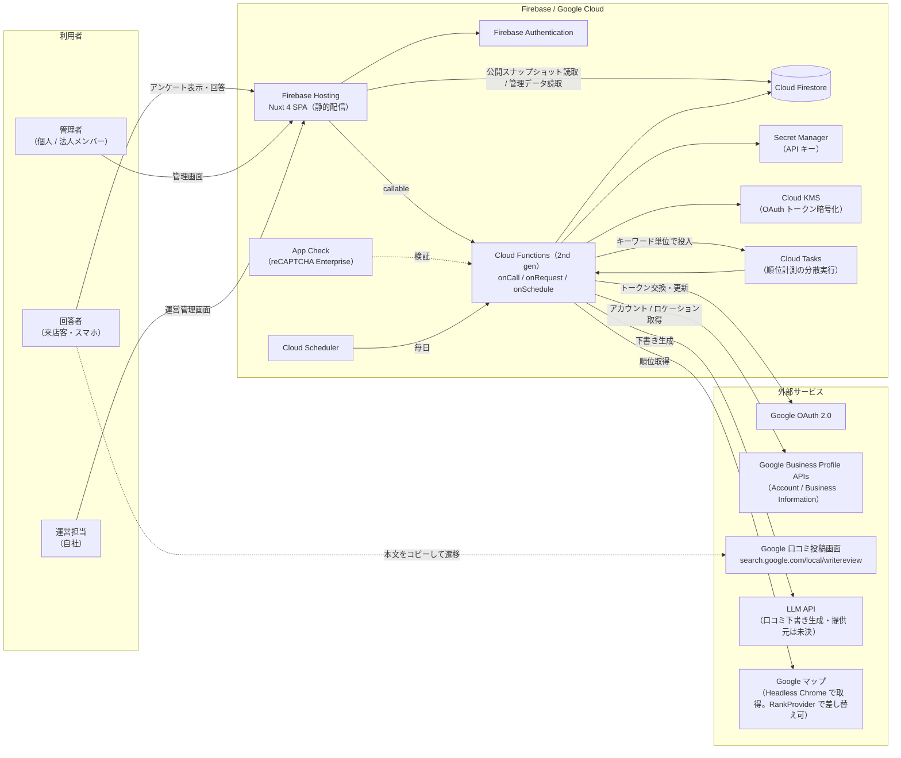
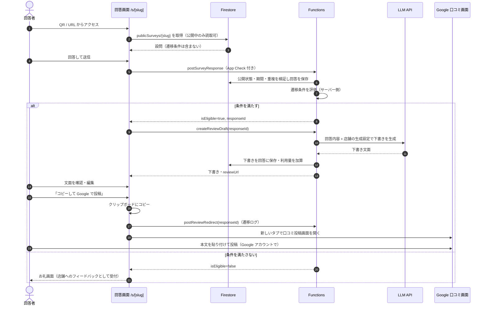
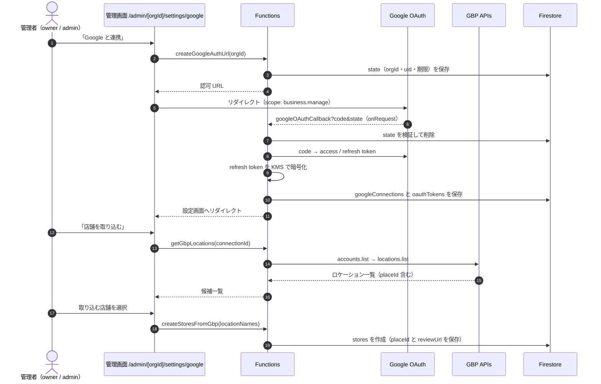
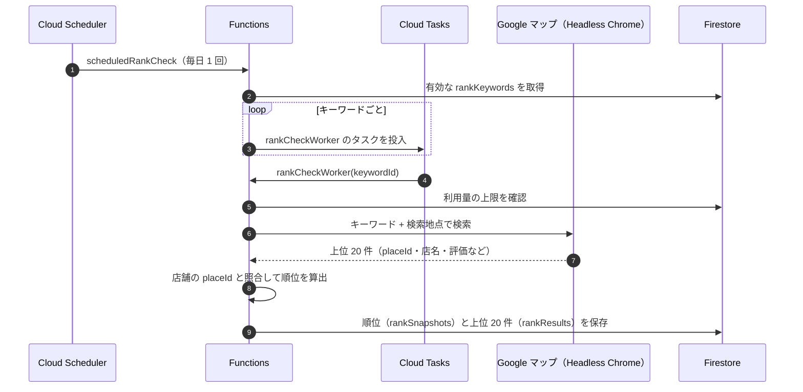

# 01. システムアーキテクチャ

## 1. 全体構成図



## 2. 構成要素と役割

| レイヤ | 要素 | 役割 | 備考 |
| --- | --- | --- | --- |
| フロント | Nuxt 4（SPA） | 回答画面・管理画面・運営画面を 1 アプリで提供 | 既存リポジトリ構成を継続。`ssr: false` で静的生成 |
| フロント | Tailwind CSS v4 | スタイル | `app/assets/css/main.css` の `@theme` をトークンの正とする |
| 配信 | Firebase Hosting | 静的ファイル配信 | 回答画面を別ドメイン / 別サイトに分けるかは I-21 |
| 認証 | Firebase Authentication | 管理者ログイン（メール / Google） | 回答者は認証しない |
| 認証 | App Check | 回答送信・下書き生成の bot 対策 | 公開エンドポイントの濫用防止 |
| API | Cloud Functions 2nd gen | 業務ロジック・外部 API 呼び出しをすべて集約 | フロントからは composables 経由で callable を呼ぶ |
| DB | Cloud Firestore | 組織・店舗・アンケート・回答・順位履歴 | 設計は `02-database.md` |
| 秘密 | Secret Manager | LLM / 順位取得 API キー、OAuth クライアントシークレット | Functions の `secrets` で注入 |
| 秘密 | Cloud KMS | GBP のリフレッシュトークンを暗号化して保存 | Firestore には暗号文のみ置く |
| バッチ | Cloud Scheduler + Cloud Tasks | 順位計測の定期実行。キーワード単位に分割して並列・リトライ | 1 関数でまとめて回すとタイムアウトしやすいため分割する |

### Functions のドメイン分割（案）

CLAUDE.md の「業務ドメインとの対応が分かるフォルダ構成」に合わせる。

```
functions/src/
├─ index.ts              エントリ。firebase-admin の初期化はここで 1 回だけ
├─ identity/             組織作成・招待・メンバー権限
├─ google/               OAuth 連携・GBP アカウント / ロケーション取得
├─ stores/               店舗の取込・更新
├─ surveys/              公開管理（公開スナップショットの生成・停止）
├─ responses/            回答受付・条件判定・口コミ下書き生成・遷移ログ
├─ rankings/             順位計測（定期 / 手動 / タスクワーカー）
├─ usage/                利用量カウント・上限判定
└─ shared/               Firestore 書き込み helper、権限チェック、LLM / 順位プロバイダのアダプタ
```

> `region` は `.claude/PROJECT.md` で定義する（現在は未記入。I-20）。

## 3. 主要シーケンス

### 3.1 アンケート回答 → 口コミ下書き → Google 遷移（R-1 / R-2）



> Google の口コミ URL は本文を受け取れないため、「生成した文面をそのまま投稿させる」ことはできません。回答者が自分で貼り付けて投稿します（I-04）。

### 3.2 Google Business Profile 連携（R-5）



### 3.3 順位計測（R-4）



> 競合の店名・評価は計測結果の 20 件として保存し、順位推移画面で日付を選んだときに読む（F-17）。

## 4. 非機能方針

| 観点 | 方針 |
| --- | --- |
| マルチテナント分離 | すべての業務データを `organizations/{orgId}` 配下に置き、ルールでメンバー判定する |
| 公開データの分離 | 回答画面が読むのは `publicSurveys` の公開スナップショットだけ。管理用の設定（遷移条件など）は公開しない |
| 秘密情報 | OAuth トークンと API キーはクライアントに出さない。トークンは KMS で暗号化し、ルールで全拒否のコレクションに置く |
| 濫用対策 | 回答送信・下書き生成は App Check 必須。回答単位で下書き生成回数に上限を設ける |
| コスト管理 | LLM と順位取得は従量課金のため、組織ごとの月次利用量を記録し上限で止める |
| 冪等性 | 回答送信はクライアント生成の `submissionId` を使って重複保存を防ぐ。順位計測は `keywordId + 日付` をドキュメント ID にする |
| 監査 | 公開 / 停止、連携 / 解除、メンバー変更を監査ログに残す |
