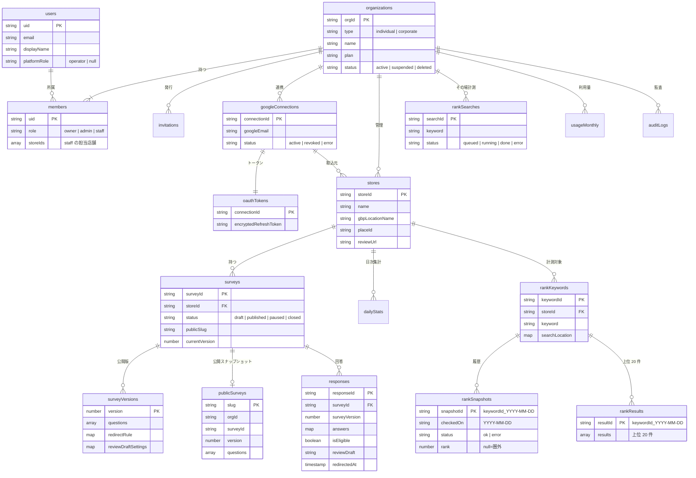

# 02. DB 設計（Cloud Firestore）

## 1. 設計方針

- **テナント境界は `organizations/{orgId}`**。業務データはすべてこの配下のサブコレクションに置く
- 回答画面（未ログイン）が読むのは **`publicSurveys/{slug}`** だけ。公開時に Functions が生成する読み取り専用スナップショット
- OAuth トークンなどの秘密は **`oauthTokens`**（ルールで全拒否・Functions のみ）に暗号化して置く
- 回答・順位履歴など件数が増えるものはサブコレクションにし、一覧表示用の集計値は親ドキュメントに持つ（非正規化）
- 日時はすべて `Timestamp`。`createdAt` / `updatedAt` を全ドキュメントに持つ（表では省略）

> Firestore を選ぶ理由: 既存構成（Firebase）との整合、ルールによるテナント分離、回答画面からのリアルタイム性不要な単純読み取りが中心であること。
> 横断集計（全組織の順位推移の分析など）が必要になったら BigQuery へのエクスポートを追加する。

## 2. ER 図



## 3. コレクション定義

### 3.1 `users/{uid}`

| フィールド | 型 | 必須 | 説明 |
| --- | --- | --- | --- |
| email | string | ○ | Auth と同期 |
| displayName | string | ○ | |
| platformRole | `'operator' \| null` | ○ | 運営担当のみ `operator`。**クライアントから変更不可** |
| lastOrgId | string | | 前回開いた組織（ログイン後の遷移先） |

> 権限判定には Custom Claims ではなく members ドキュメントを使う（組織が複数あり、Claims のサイズ上限と即時反映の問題を避けるため）。運営フラグのみ Custom Claims `operator: true` を併用する。

### 3.2 `organizations/{orgId}`

| フィールド | 型 | 必須 | 説明 |
| --- | --- | --- | --- |
| type | `'individual' \| 'corporate'` | ○ | **出しわけの基準**。作成後は運営のみ変更可 |
| name | string | ○ | 屋号 / 法人名 |
| plan | string | ○ | 料金プラン（I-16） |
| status | `'active' \| 'suspended' \| 'deleted'` | ○ | `suspended` のとき公開アンケートも停止 |
| limits | map | ○ | `{ maxStores, maxSurveys, maxKeywords, monthlyReviewDrafts, monthlyRankChecks }` プランから複製 |
| counts | map | ○ | `{ stores, surveys, keywords, members }` 一覧・上限判定用の非正規化値 |
| ownerUid | string | ○ | |

### 3.3 `organizations/{orgId}/members/{uid}`

| フィールド | 型 | 必須 | 説明 |
| --- | --- | --- | --- |
| role | `'owner' \| 'admin' \| 'staff'` | ○ | 個人組織は `owner` のみ |
| storeIds | string[] | | `staff` の担当店舗。空なら担当なし。`owner` / `admin` は全店舗 |
| email / displayName | string | ○ | 一覧表示用の非正規化 |
| joinedAt | Timestamp | ○ | |

### 3.4 `organizations/{orgId}/invitations/{invitationId}`（法人のみ）

| フィールド | 型 | 必須 | 説明 |
| --- | --- | --- | --- |
| email | string | ○ | 招待先 |
| role | `'admin' \| 'staff'` | ○ | |
| storeIds | string[] | | staff の担当店舗 |
| tokenHash | string | ○ | 招待 URL のトークンのハッシュ（平文は保存しない） |
| status | `'pending' \| 'accepted' \| 'revoked' \| 'expired'` | ○ | |
| expiresAt | Timestamp | ○ | 既定 7 日 |
| invitedBy | string | ○ | uid |

### 3.5 `organizations/{orgId}/googleConnections/{connectionId}`

| フィールド | 型 | 必須 | 説明 |
| --- | --- | --- | --- |
| googleEmail | string | ○ | 連携した Google アカウント |
| gbpAccounts | `{ name, accountName, type }[]` | ○ | `accounts/123...` の一覧（取得時点） |
| scopes | string[] | ○ | |
| status | `'active' \| 'revoked' \| 'error'` | ○ | トークン更新失敗時に `error` |
| lastError | string | | |
| connectedBy | string | ○ | uid |

### 3.6 `oauthTokens/{connectionId}`（**ルールで全拒否**）

| フィールド | 型 | 必須 | 説明 |
| --- | --- | --- | --- |
| orgId | string | ○ | |
| encryptedRefreshToken | string | ○ | Cloud KMS で暗号化した値 |
| kmsKeyVersion | string | ○ | 鍵ローテーション用 |

### 3.7 `oauthStates/{state}`（**ルールで全拒否**・TTL）

OAuth の CSRF 対策。`orgId` / `uid` / `expiresAt`（10 分）。Firestore の TTL ポリシーで自動削除。

### 3.8 `organizations/{orgId}/stores/{storeId}`

| フィールド | 型 | 必須 | 説明 |
| --- | --- | --- | --- |
| name | string | ○ | GBP から取得。手動修正可 |
| address | string | | |
| location | GeoPoint | | 順位計測の既定地点 |
| connectionId | string | | 取込元の連携。手動登録の場合は空 |
| gbpLocationName | string | | `locations/...` |
| placeId | string | ○ | 口コミ URL と順位照合のキー |
| reviewUrl | string | ○ | `https://search.google.com/local/writereview?placeid={placeId}` |
| status | `'active' \| 'archived'` | ○ | |
| stats | map | | `{ responses, eligible, redirected, latestAvgScore }` ダッシュボード用 |

### 3.8.1 `organizations/{orgId}/stores/{storeId}/dailyStats/{YYYY-MM-DD}`

ダッシュボードの期間集計用（F-18）。回答作成・遷移記録時に Functions が `increment` する。

| フィールド | 型 | 説明 |
| --- | --- | --- |
| responses | number | 回答数 |
| eligible | number | 条件合致数 |
| redirected | number | Google 遷移数 |
| ratingSum / ratingCount | number | 総合評価の平均算出用 |

### 3.9 `organizations/{orgId}/surveys/{surveyId}`（編集用・下書きを含む）

下書きはクライアントから直接書かず、`updateSurveyDraft`（Functions）で保存する。書き込みはすべて Functions のみ。

| フィールド | 型 | 必須 | 説明 |
| --- | --- | --- | --- |
| storeId | string | ○ | |
| title | string | ○ | 管理用名称 |
| status | `'draft' \| 'published' \| 'paused' \| 'closed'` | ○ | 状態遷移は `04-features.md` F-09 |
| publicSlug | string | ○ | 推測されにくいランダム値（例: 10 文字）。再発行可 |
| draft | map | ○ | 編集中の `{ questions, redirectRule, reviewDraftSettings, design }` |
| currentVersion | number | | 公開中のバージョン |
| hasUnpublishedChanges | boolean | ○ | 公開版と下書きの差分有無 |
| publishPeriod | `{ startAt?, endAt? }` | | 期間外は回答不可 |
| stats | map | | `{ responses, eligible, redirected }` |

#### `questions[]` の要素

| フィールド | 型 | 説明 |
| --- | --- | --- |
| id | string | 設問 ID（バージョン間で維持） |
| type | `'rating' \| 'nps' \| 'single' \| 'multi' \| 'text'` | 星評価 / 0-10 / 単一選択 / 複数選択 / 自由記述 |
| label | string | |
| isRequired | boolean | |
| options | `{ id, label }[]` | 選択式のみ |
| scale | `{ min, max }` | rating / nps のみ |
| useForReviewDraft | boolean | 口コミ下書きの材料に使うか |

#### `redirectRule`（遷移条件）

```ts
{
  operator: 'and' | 'or',
  conditions: [
    { questionId: 'q1', comparator: 'gte', value: 4 },          // 星 4 以上
    { questionId: 'q3', comparator: 'includes', value: 'opt2' }  // 選択肢を含む
  ]
}
```

`comparator` は `eq | neq | gte | lte | includes | notIncludes | notEmpty`。

#### `reviewDraftSettings`（文章生成設定）

| フィールド | 型 | 説明 |
| --- | --- | --- |
| isEnabled | boolean | オフなら下書き生成せず空欄で遷移 |
| tone | `'casual' \| 'polite'` | |
| length | `'short' \| 'medium'` | 目安文字数 |
| storeHighlights | string[] | 店舗が伝えたい特徴（生成時の参考情報） |
| ngWords | string[] | 出力に含めない語 |

### 3.10 `organizations/{orgId}/surveyVersions/{surveyId}_{n}`

パスは `surveys` のサブコレクションではなく、組織直下の `surveyVersions/{surveyId}_{n}`。`storeId` を持たせている（staff の担当店舗の絞り込みを `storeId in` の購読で扱うため）。

公開ボタン押下時に `draft` を凍結したもの。回答は必ずどれかのバージョンに紐づくため、公開後に設問を変えても過去回答の意味が崩れない。

| フィールド | 型 | 説明 |
| --- | --- | --- |
| questions / redirectRule / reviewDraftSettings / design | — | `draft` の複製 |
| orgId / surveyId / storeId / version | string / number | 参照用（`storeId` は staff の絞り込み用） |
| publishedBy / publishedAt | string / Timestamp | |

### 3.11 `publicSurveys/{slug}`（未ログインで slug 指定の 1 件を読取可・一覧は不可・書込は Functions のみ）

| フィールド | 型 | 説明 |
| --- | --- | --- |
| orgId / surveyId / storeId | string | 回答送信時の参照用 |
| version | number | |
| storeName | string | 画面表示用 |
| questions | array | **`redirectRule` と `reviewDraftSettings` は含めない** |
| design | map | ロゴ・テーマ色・冒頭文・お礼文 |
| status | `'published' \| 'paused'` | 一時停止中も `paused` で残り、回答画面は「受付停止中」を出す。終了・店舗のアーカイブで削除する。ルールは誰でも slug を指定して 1 件読める（`get` のみ。`list` は不可） |
| publishPeriod | map | |

### 3.12 `organizations/{orgId}/responses/{responseId}`

ドキュメント ID = クライアント生成の `submissionId`（UUID）。**再送信しても 1 件になる（冪等）**。

| フィールド | 型 | 必須 | 説明 |
| --- | --- | --- | --- |
| surveyId / storeId | string | ○ | |
| surveyVersion | number | ○ | |
| answers | map | ○ | `{ [questionId]: number \| string \| string[] }` |
| isEligible | boolean | ○ | 遷移条件の判定結果（サーバーで算出） |
| reviewDraft | null | | 文面の生成は今回は作らないので、常に `null` |
| redirectedAt | Timestamp | | 「Google で投稿」押下時刻。投稿完了は検知できない |
| ipHash | string | ○ | `SHA-256(IP_HASH_SALT + ':' + ip)` の 16 進数（64 文字）。サーバーだけが使う（画面の型には持たない）。IP の生値は保存しない |

> 回答者の氏名・連絡先は**収集しない前提**。収集する場合は個人情報の取扱いが変わる（I-11）。

### 3.12a `rateLimits/{slug}_{ipHash}`（トップレベル）

`{ hits: Timestamp[], expireAt: Timestamp }`。`expireAt` は最後の受付から 1 日後で、Firestore の TTL で消す。直近 10 分の受付時刻。同じ接続元から同じアンケートへは 10 分で 5 件まで。ルールに記載せず全員拒否（Functions のみ）。

### 3.13 `organizations/{orgId}/rankKeywords/{keywordId}`

| フィールド | 型 | 必須 | 説明 |
| --- | --- | --- | --- |
| orgId | string | ○ | |
| storeId | string | ○ | |
| keyword | string | ○ | 例: `渋谷 カフェ`。全角スペースを含む空白を半角 1 つにまとめ、前後を除いて 2〜100 文字。スペース区切りは AND 検索になる |
| searchLocation | `{ lat, lng, label }` | ○ | 検索地点。画面は市区町村（`app/utils/geo/municipalities.json`）から選ぶ。サーバーは緯度 20〜46・経度 122〜154・`label` 1〜50 文字を検証する |
| isActive | boolean | ○ | 定期計測の対象 |
| createdBy | string | ○ | 登録した uid |
| createdAt | Timestamp | ○ | |
| pendingCheckAt | Timestamp \| null | | 計測を受け付けてから完了するまで値が入る（画面の「計測中」）。10 分より古い値は計測中とみなさない |
| lastManualCheckAt | Timestamp \| null | | 手動計測の 1 時間制限の判定に使う |

> 前日比・前週比は画面側でスナップショットから計算する（`latest` の非正規化はしない）。

### 3.14 順位の計測結果（`rankSnapshots` / `rankResults`）

購読を軽く保つため、日々の順位（小）と 20 件の結果（大）を別のドキュメントに分ける。どちらも staff の絞り込み（`storeId in`）ができるよう組織直下に置き、ID は `{keywordId}_{YYYY-MM-DD}`（JST）にする。同日の再実行は上書きになる（冪等）。

#### `organizations/{orgId}/rankSnapshots/{keywordId}_{YYYY-MM-DD}`（直近 90 日を購読する）

| フィールド | 型 | 説明 |
| --- | --- | --- |
| orgId / keywordId / storeId | string | |
| checkedOn | string | `YYYY-MM-DD`（JST） |
| checkedAt | Timestamp | |
| trigger | `'scheduled' \| 'manual'` | |
| status | `'ok' \| 'error'` | 同じ日の `ok` を `error` で上書きしない |
| errorCode | `'blocked' \| 'timeout' \| 'parse' \| null` | |
| rank | number \| null | `null` は圏外（21 位以下または一致なし）。`status` が `error` のときも `null` |
| matchedBy | `'placeId' \| 'name' \| null` | 自店との照合方法。placeId を優先し、結果の placeId が `null` のものに限り正規化した店名の完全一致で照合する |
| resultCount | number | 取得した件数 |
| provider | string | 取得元（`gmaps-scraper`。取得元を替えたときの追跡用） |

#### `organizations/{orgId}/rankResults/{keywordId}_{YYYY-MM-DD}`（購読しない。日付を選んだときに 1 件読む）

`status: 'ok'` のときだけ書く。

| フィールド | 型 | 説明 |
| --- | --- | --- |
| orgId / keywordId / storeId / checkedOn | string | |
| results | `RankResult[]` | 上位 20 件。`{ rank, placeId \| null, name, rating \| null, reviewCount \| null, category \| null }`。「スポンサー」付きのカードは含めない |

> 競合の店名・評価はここに保存した計測結果をそのまま使う（旧設計の `topPlaceIds` と `getRankCompetitorsFunc` は廃止。I-26）。`reviewCount` は取得できない場合に `null`（I-27）。

### 3.14a `organizations/{orgId}/rankSearches/{searchId}`（その場計測）

キーワードを登録せずに計測した結果。owner / admin だけが読める。

| フィールド | 型 | 説明 |
| --- | --- | --- |
| orgId | string | |
| keyword / searchLocation | string / `{ lat, lng, label }` | キーワードと同じ正規化・検証 |
| storeId | string \| null | 指定したときだけ自店の順位を出す |
| status | `'queued' \| 'running' \| 'done' \| 'error'` | |
| errorCode | `'blocked' \| 'timeout' \| 'parse' \| null` | |
| rank / matchedBy | number \| null / `'placeId' \| 'name' \| null` | |
| results | `RankResult[]` | 上位 20 件 |
| createdBy / createdAt / finishedAt | string / Timestamp / Timestamp \| null | |
| expireAt | Timestamp | 作成から 30 日後。Firestore の TTL ポリシーで自動削除する（設定手順は `.claude/PROJECT.md`） |

### 3.14b `rankRuns/{YYYY-MM-DD}`（日次計測の集計。トップレベル）

`{ day, done, blocked, cutOffAt }`。ワーカーが計測の成否を加算する。`blocked >= 10` かつ `blocked / (blocked + done) > 0.3` のとき、その日の日次計測のタスクは取得をせずに `error / blocked` を保存して打ち切る（打ち切りのログは `cutOffAt` で 1 回だけ出す）。手動計測とその場計測は対象外。サブコレクション `rankRuns/{day}/orgs/{orgId}`（`granted`）は、日次計測の二重予約を防ぐ。ルールで全拒否（Functions のみ）。

### 3.15 `organizations/{orgId}/usageMonthly/{YYYYMM}`

`{ orgId, month, reviewDrafts, rankChecks, responses }` を `FieldValue.increment` で加算。順位計測（日次・手動・その場計測）は、タスクの受け付け時に `rankChecks` を加算する（ワーカーの再試行では二重に数えない）。`responses` はアンケートの回答の受付時（JST の月）に加算する。上限判定は Functions で行う。

### 3.16 `organizations/{orgId}/auditLogs/{logId}`

`{ actorUid, action, targetPath, before?, after?, createdAt }`。ルールで読取は owner / admin、書込は Functions のみ。

## 4. インデックス（複合）

| コレクション | フィールド | 用途 |
| --- | --- | --- |
| responses | `surveyId ASC, createdAt DESC` | アンケート別回答一覧 |
| responses | `storeId ASC, createdAt DESC` | 店舗別回答一覧（staff の担当店舗絞り込み） |
| responses | `surveyId ASC, storeId ASC, createdAt DESC` | CSV の検索（店舗の指定あり） |
| responses | `surveyId ASC, isEligible ASC, createdAt DESC` | 条件合致のみ表示（将来の想定。未作成） |
| surveys | `storeId ASC, status ASC, updatedAt DESC` | 店舗別アンケート一覧（将来の想定。未作成） |
| rankKeywords（collection group） | `isActive ASC`（単一フィールドの例外設定。`firestore.indexes.json` の `fieldOverrides`） | 定期計測の対象抽出。店舗別の一覧用の複合インデックスは定義していない |
| rankSnapshots | `storeId ASC, checkedOn ASC` | staff の担当店舗の購読 |

## 5. セキュリティルール方針

| 対象 | 読取 | 書込 |
| --- | --- | --- |
| `users/{uid}` | 本人 | 本人（`platformRole` 以外） |
| `organizations/{orgId}` | メンバー | owner（`type` `plan` `limits` `status` は Functions のみ） |
| `members` | メンバー | Functions のみ（招待受諾・権限変更を経由させる） |
| `invitations` | owner / admin | Functions のみ |
| `googleConnections` | owner / admin | Functions のみ |
| `oauthTokens` `oauthStates` | 全拒否 | 全拒否（Admin SDK のみ） |
| `stores` | メンバー（staff は担当店舗のみ） | owner / admin |
| `stores/dailyStats` | 同上 | Functions のみ |
| `surveys`（下書きを含む） | メンバー（staff は担当店舗のみ） | Functions のみ（`updateSurveyDraft` など） |
| `surveyVersions` | メンバー（staff は担当店舗のみ） | Functions のみ |
| `publicSurveys` | 誰でも slug を指定して 1 件読める（`get` のみ。`list` は不可。中身は公開用の情報だけ） | Functions のみ |
| `rateLimits` | 全拒否 | Functions のみ |
| `responses` | メンバー（staff は担当店舗のみ） | Functions のみ |
| `rankKeywords` | メンバー（staff は担当店舗のみ） | Functions のみ（登録・停止・削除は owner / admin が callable 経由） |
| `rankSnapshots` `rankResults` | 同上 | Functions のみ |
| `rankSearches` | owner / admin | Functions のみ |
| `rankRuns`（トップレベル） | 全拒否 | Functions のみ |
| `usageMonthly` | メンバー | Functions のみ |
| `auditLogs` | owner / admin | Functions のみ |
| すべて | 運営（`request.auth.token.operator == true`）は読取可 | — |

> ルールの `get()` 呼び出し回数を抑えるため、メンバー判定は `members/{request.auth.uid}` の 1 回の `get()` にまとめる。
