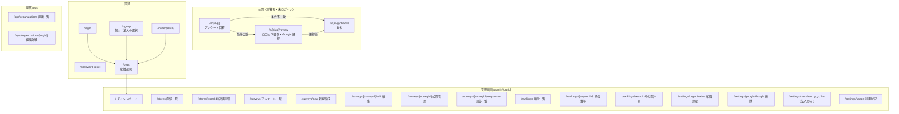

# 03. ページ設計

## 1. サイトマップ

- 管理画面の URL に `orgId` を含める。複数組織に所属するユーザーが組織を切り替えても、ブックマークや共有 URL が壊れない
- 回答画面の URL はランダムな `slug` にし、組織 ID や店舗 ID を出さない

## 2. レイアウト

| レイアウト | 使用ページ | 構成 |
| --- | --- | --- |
| `survey` | `/s/**` | 店舗ロゴ・店舗名だけのヘッダー。スマホ 1 カラム。ナビなし |
| `auth` | `/login` `/signup` `/password-reset` `/invite/**` `/orgs` | 中央寄せカード |
| `admin` | `/admin/**` | ヘッダー（組織切替・ユーザーメニュー）+ サイドナビ（PC）/ ボトムタブ（SP） |
| `ops` | `/ops/**` | 運営用ヘッダー。管理画面と見た目を分けて誤操作を防ぐ |

## 3. ミドルウェア

| 名前 | 適用 | 役割 |
| --- | --- | --- |
| `auth` | `/admin/**` `/orgs` `/ops/**` | 未ログインなら `/login?redirect=...` |
| `org-member` | `/admin/[orgId]/**` | 組織のメンバーでなければ `/orgs`。組織情報とロールを `useCurrentOrg` に読み込む |
| `org-role` | `definePageMeta({ roles, orgTypes })` を持つページ | ロール・組織種別が合わなければダッシュボードへ |
| `operator` | `/ops/**` | 運営フラグがなければ 404 表示 |

## 4. 出しわけ（個人 / 法人・ロール）

### 4.1 組織種別による差分

| 項目 | 個人（individual） | 法人（corporate） |
| --- | --- | --- |
| メンバー | owner 1 名のみ | owner / admin / staff 複数 |
| `/settings/members` | **非表示** | 表示 |
| 店舗数 | プラン上限（前提: 少数） | プラン上限（多店舗） |
| 店舗切替 UI | 店舗 1 件のときは非表示 | ヘッダーに店舗フィルタ |
| ダッシュボード | 単一店舗のサマリー | 店舗横断の比較表 + 店舗別サマリー |
| staff の担当店舗 | — | 担当店舗のデータだけ表示 |

### 4.2 ロール別の権限（法人）

○ = 可 / △ = 担当店舗のみ / — = 不可（メニュー自体を出さない）

| 機能 | owner | admin | staff |
| --- | --- | --- | --- |
| ダッシュボード閲覧 | ○ | ○ | △ |
| 店舗の取込・編集・アーカイブ | ○ | ○ | — |
| アンケートの作成・編集 | ○ | ○ | △ |
| アンケートの公開・停止 | ○ | ○ | △ |
| 回答の閲覧・CSV 出力 | ○ | ○ | △ |
| 順位キーワードの登録・削除 | ○ | ○ | — |
| その場計測 | ○ | ○ | — |
| 順位の閲覧・手動計測 | ○ | ○ | △（閲覧のみ） |
| Google 連携・解除 | ○ | ○ | — |
| メンバー招待・権限変更 | ○ | ○（owner の変更は不可） | — |
| 組織設定・プラン・退会 | ○ | — | — |

> 個人組織の owner は法人 owner と同じ権限。ロール別の staff 権限は案のため I-13 で確定する。

## 5. ページ詳細

各ページの「主な機能」は `04-features.md` の機能 ID。

### 5.1 公開（回答者）

| パス | ページ名 | 役割 | 主な表示・操作 | 主な機能 |
| --- | --- | --- | --- | --- |
| `/s/[slug]` | アンケート回答 | 設問を表示し回答を受け付ける | 店舗名・冒頭文、設問（星 / NPS / 選択 / 自由記述）、必須チェック、送信。停止中・期間外は「現在受け付けていません」 | F-10, F-11 |
| `/s/[slug]/review` | 口コミ下書き | 条件合致者に下書きを提示し Google へ送る | 生成中ローディング、編集可能なテキストエリア、「別の文面にする」（回数上限あり）、「コピーして Google で投稿」、投稿手順の説明（貼り付け → 星を選ぶ → 投稿）、「投稿しない」 | F-12, F-13 |
| `/s/[slug]/thanks` | お礼 | 回答完了を伝える | 設定したお礼文。条件不一致時は「ご意見は店舗に届きました」 | F-10 |

- `useSeoMeta({ robots: 'noindex, nofollow' })` を全ページに付ける
- `/s/[slug]/review` に直接アクセスされた場合は、`sessionStorage` の `responseId` がなければ `/s/[slug]` に戻す

### 5.2 認証

| パス | ページ名 | 役割 | 主な表示・操作 | 主な機能 |
| --- | --- | --- | --- | --- |
| `/login` | ログイン | 管理者ログイン | メール + パスワード、Google でログイン | F-01 |
| `/signup` | 新規登録 | アカウントと組織を作成 | **個人 / 法人の選択**、屋号・法人名、規約同意 | F-01 |
| `/password-reset` | パスワード再設定 | | メール送信 | F-01 |
| `/invite/[token]` | 招待受諾 | 法人メンバーとして参加 | 招待元組織・ロールの表示、ログイン / 新規登録して参加 | F-03 |
| `/orgs` | 組織選択 | 所属組織を選ぶ | 所属組織一覧（種別バッジ）、1 件だけなら自動遷移 | F-02 |

### 5.3 管理画面 `/admin/[orgId]`

| パス | ページ名 | 役割 | 主な表示・操作 | 主な機能 | 権限 |
| --- | --- | --- | --- | --- | --- |
| `/` | ダッシュボード | 全体の状況把握 | 回答数・条件合致率・Google 遷移数（期間切替）、主要キーワードの最新順位と前日差、未連携・連携エラーの警告、公開中アンケート一覧 | F-18 | 全員（staff は担当店舗） |
| `/stores` | 店舗一覧 | 店舗の一覧・追加 | 店舗カード（公開中アンケート数・最新順位）、「GBP から取り込む」モーダル | F-05 | 全員 / 取込は owner・admin |
| `/stores/[storeId]` | 店舗詳細 | 店舗情報と関連データ | 基本情報（GBP 由来）、口コミ URL の確認・テスト、紐づくアンケート、順位キーワード | F-05 | 同上 |
| `/surveys` | アンケート一覧 | アンケートの一覧と状態 | 店舗・状態フィルタ、状態バッジ、回答数、複製 | F-06, F-09 | 全員 |
| `/surveys/new` | 新規作成 | 店舗とテンプレートを選んで作成 | 店舗選択、テンプレート選択（空 / 標準） | F-06 | owner・admin・担当 staff |
| `/surveys/[surveyId]/edit` | 編集 | 設問・条件・生成設定の編集 | タブ: **設問**（追加・並べ替え・必須）/ **遷移条件**（条件ビルダー）/ **口コミ生成**（トーン・長さ・店舗の特徴・NG ワード・テスト生成）/ **デザイン**（ロゴ・色・冒頭文・お礼文）。右側にスマホプレビュー。自動保存 | F-06, F-07, F-08 | 同上 |
| `/surveys/[surveyId]` | 公開管理 | 公開状態と配布 | 状態（下書き / 公開中 / 一時停止 / 終了）と操作ボタン、未公開の変更ありの表示、公開期間、公開 URL・コピー、QR コード（PNG / SVG ダウンロード）、URL の再発行、公開履歴（バージョン） | F-09 | 同上 |
| `/surveys/[surveyId]/responses` | 回答一覧 | 回答の確認・出力 | 期間・条件合致・遷移有無で絞り込み、回答詳細ドロワー（生成文面を含む）、設問ごとの集計、CSV 出力 | F-14 | 全員（staff は担当店舗） |
| `/rankings` | 順位一覧 | キーワード別の現在順位 | 店舗フィルタ、キーワード × 最新順位 × 前日 / 前週差、ミニ推移グラフ、「今すぐ計測」、キーワード追加モーダル（`Ranking/Rankings/KeywordFormModal.vue`。キーワードと検索地点を市区町村の選択で指定）、計測中・取得エラーの表示、「その場で計測」への導線 | F-15, F-16, F-17 | 全員 / 登録は owner・admin |
| `/rankings/[keywordId]` | 順位推移 | 1 キーワードの詳細 | 期間別の推移グラフ、日別表、選んだ日の上位 20 件（競合）一覧（保存済みの計測結果を表示）、計測地点、取得エラーの日の表示 | F-17 | 全員 |
| `/rankings/search` | その場計測 | キーワードを登録せずに順位を確認 | 地域（市区町村）・キーワード・店舗（任意）の入力（`<RankingSearchForm>`）、計測中の表示、上位 20 件の表と自店の順位、直近 30 日の計測履歴、「このキーワードを登録」 | F-17a | owner・admin |
| `/settings/organization` | 組織設定 | 組織情報 | 名称、種別（表示のみ）、退会 | F-02 | owner |
| `/settings/google` | Google 連携 | GBP との連携管理 | 連携中の Google アカウント・GBP アカウント、状態、「連携する」「再認証」「解除」 | F-04 | owner・admin |
| `/settings/members` | メンバー | 法人のメンバー管理 | メンバー一覧、招待（メール・ロール・担当店舗）、権限変更、削除、招待の取消 | F-03 | owner・admin / **法人のみ** |
| `/settings/usage` | 利用状況 | 当月の利用量と上限 | 口コミ生成数・順位計測数・店舗 / キーワード数とプラン上限 | F-19 | owner・admin |

### 5.4 運営 `/ops`

| パス | ページ名 | 役割 | 主な機能 |
| --- | --- | --- | --- |
| `/ops/organizations` | 組織一覧 | 全組織の検索・状態確認 | F-20 |
| `/ops/organizations/[orgId]` | 組織詳細 | プラン・上限の変更、利用停止、連携エラーの確認 | F-20 |

## 6. コンポーネント配置（CLAUDE.md の配置ルールに沿った想定）

| 機能フォルダ | 主なコンポーネント |
| --- | --- |
| `components/Survey/` | `Input/RatingInput.vue` `Input/NpsInput.vue` `Input/ChoiceInput.vue`、`Review/DraftEditor.vue`（回答者側） |
| `components/Admin/` | `Layout/Header.vue` `Layout/SideNav.vue` `Layout/BottomTab.vue` `Layout/OrgSwitcher.vue`、`Common/StoreFilter.vue` `Common/StatusBadge.vue` |
| `components/SurveyEditor/` | `Edit/QuestionList.vue` `Edit/RuleBuilder.vue` `Edit/DraftSettings.vue` `Common/PhonePreview.vue` |
| `components/Ranking/` | `Common/RankTrendChart.vue` `Common/RankDiff.vue` `Index/KeywordFormModal.vue` |

> 回答者側の入力部品を管理画面のプレビューでも使うため、`Survey/Input/` は両方から参照する前提。
