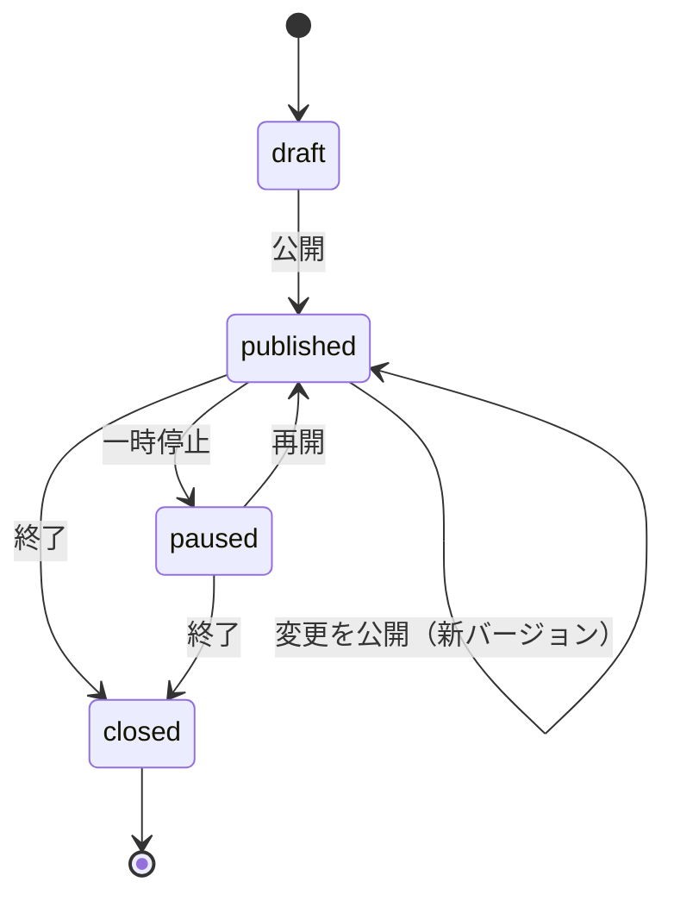

# 04. 機能詳細設計

## 1. 機能一覧

| ID | 機能 | 区分 | 要件 | 使用ページ |
| --- | --- | --- | --- | --- |
| F-01 | 認証・アカウント登録（個人 / 法人） | 認証 | R-5 | `/login` `/signup` `/password-reset` |
| F-02 | 組織コンテキスト・出しわけ | 認証 | R-5 | `/orgs` `/admin/**` 全体、`/settings/organization` |
| F-03 | メンバー招待・権限管理（法人） | 認証 | R-5 | `/settings/members` `/invite/[token]` |
| F-04 | Google Business Profile 連携 | 連携 | R-5 | `/settings/google` |
| F-05 | 店舗の取込・管理 | 連携 | R-5 | `/stores` `/stores/[storeId]` |
| F-06 | アンケート作成（設問ビルダー） | アンケート | R-3 | `/surveys` `/surveys/new` `/surveys/[id]/edit` |
| F-07 | 遷移条件の設定 | アンケート | R-1, R-3 | `/surveys/[id]/edit`（遷移条件タブ） |
| F-08 | 口コミ生成設定・テスト生成 | アンケート | R-2, R-3 | `/surveys/[id]/edit`（口コミ生成タブ） |
| F-09 | 公開管理（公開・停止・期間・URL・QR） | アンケート | R-3 | `/surveys` `/surveys/[id]` |
| F-10 | アンケート回答受付 | 回答 | R-1 | `/s/[slug]` `/s/[slug]/thanks` |
| F-11 | 遷移条件の判定 | 回答 | R-1 | `/s/[slug]`（送信時・サーバー処理） |
| F-12 | 口コミ下書き生成 | 回答 | R-2 | `/s/[slug]/review` |
| F-13 | Google 口コミへの遷移 | 回答 | R-1, R-2 | `/s/[slug]/review` |
| F-14 | 回答一覧・集計・CSV | 分析 | R-3 | `/surveys/[id]/responses` |
| F-15 | 順位キーワード管理 | 順位 | R-4 | `/rankings` `/stores/[storeId]` |
| F-16 | 順位計測（定期 / 手動） | 順位 | R-4 | `/rankings`（手動）、バッチ |
| F-17 | 順位表示（一覧・推移・競合） | 順位 | R-4 | `/rankings` `/rankings/[keywordId]` `/` |
| F-17a | その場計測 | 順位 | R-4 | `/rankings/search` |
| F-18 | ダッシュボード | 分析 | R-3, R-4 | `/admin/[orgId]` |
| F-19 | 利用量管理・上限 | 共通 | — | `/settings/usage`、F-12 / F-16 の内部 |
| F-20 | 運営管理 | 運営 | — | `/ops/**` |

## 2. ページ × 機能 マトリクス

● = 主機能 / ○ = 一部利用

| ページ | F01 | F02 | F03 | F04 | F05 | F06 | F07 | F08 | F09 | F10 | F11 | F12 | F13 | F14 | F15 | F16 | F17 | F18 | F19 | F20 |
| --- | --- | --- | --- | --- | --- | --- | --- | --- | --- | --- | --- | --- | --- | --- | --- | --- | --- | --- | --- | --- |
| `/s/[slug]` | | | | | | | | | | ● | ● | | | | | | | | | |
| `/s/[slug]/review` | | | | | | | | | | | | ● | ● | | | | | | ○ | |
| `/s/[slug]/thanks` | | | | | | | | | | ● | | | | | | | | | | |
| `/login` `/signup` `/password-reset` | ● | | | | | | | | | | | | | | | | | | | |
| `/invite/[token]` | ○ | | ● | | | | | | | | | | | | | | | | | |
| `/orgs` | | ● | | | | | | | | | | | | | | | | | | |
| `/admin/[orgId]` | | ○ | | ○ | | | | | ○ | | | | | | | | ○ | ● | | |
| `/stores` `/stores/[id]` | | ○ | | ○ | ● | | | | ○ | | | | | | ○ | | ○ | | ○ | |
| `/surveys` | | ○ | | | | ● | | | ● | | | | | | | | | | | |
| `/surveys/new` | | ○ | | | | ● | | | | | | | | | | | | | ○ | |
| `/surveys/[id]/edit` | | ○ | | | | ● | ● | ● | | | | | | | | | | | ○ | |
| `/surveys/[id]` | | ○ | | | | | | | ● | | | | | | | | | | | |
| `/surveys/[id]/responses` | | ○ | | | | | | | | | | | | ● | | | | | | |
| `/rankings` | | ○ | | | | | | | | | | | | | ● | ● | ● | | ○ | |
| `/rankings/[keywordId]` | | ○ | | | | | | | | | | | | | | ○ | ● | | | |
| `/settings/organization` | | ● | | | | | | | | | | | | | | | | | | |
| `/settings/google` | | ○ | | ● | ○ | | | | | | | | | | | | | | | |
| `/settings/members` | | ○ | ● | | | | | | | | | | | | | | | | | |
| `/settings/usage` | | ○ | | | | | | | | | | | | | | | | | ● | |
| `/ops/**` | | | | | | | | | | | | | | | | | | | ○ | ● |

## 3. 実装配置の命名

- フロント: Functions 呼び出しは **composables 経由**（`use` + PascalCase）
- Functions: ハンドラは `*Func` サフィックス、フォルダはドメイン単位（`01-architecture.md` 参照）
- `index.ts` の export 名の規則は `.claude/PROJECT.md`「Functions」で定義する（未定義。I-20）

---

## F-01 認証・アカウント登録（個人 / 法人）

**使用ページ:** `/login` `/signup` `/password-reset`

| 項目 | 内容 |
| --- | --- |
| 概要 | Firebase Auth（メール / パスワード、Google）でログイン。新規登録時に組織を 1 つ作成し、作成者を owner にする |
| 入力 | 組織種別（個人 / 法人）、組織名、メール、パスワード、規約同意 |
| 処理 | ① Auth ユーザー作成 → ② `createOrganizationFunc` で `organizations` と `members/{uid}`（owner）、`users/{uid}` を**同一トランザクション**で作成 → ③ `/admin/[orgId]` へ |
| 冪等性 | ②は `users/{uid}` に `pendingOrgId` があれば再作成しない（ネットワーク再送対策） |
| 異常系 | メール重複、弱いパスワード、②失敗時は「組織作成をやり直す」画面を表示（Auth ユーザーだけ残る状態を回復可能にする） |
| フロント | `useAuth`（ログイン状態・ログイン / ログアウト）、`useSignup` |
| Functions | `identity/createOrganizationFunc`（onCall） |

## F-02 組織コンテキスト・出しわけ

**使用ページ:** `/orgs`、`/admin/**` 全体、`/settings/organization`

| 項目 | 内容 |
| --- | --- |
| 概要 | 現在の組織・ロール・組織種別を保持し、ナビゲーション・ページ・ボタンの表示可否を決める |
| 仕様 | ・`/admin/[orgId]` の `orgId` を正とする ・`members/{uid}` と `organizations/{orgId}` を購読 ・`definePageMeta({ roles: ['owner','admin'], orgTypes: ['corporate'] })` で遷移制御 ・サイドナビ項目は `useAdminNav` にまとめ、各項目に `roles` / `orgTypes` を持たせて絞り込む |
| 表示制御 | `canManageMembers` = 法人 かつ owner / admin、`canManageStores` = owner / admin、`visibleStoreIds` = staff は `storeIds`、他は全店舗 |
| 注意 | UI の出しわけは利便性のため。**権限の最終判定はセキュリティルールと Functions で行う** |
| フロント | `useCurrentOrg`、`useAdminNav`、middleware `org-member` `org-role` |

## F-03 メンバー招待・権限管理（法人のみ）

**使用ページ:** `/settings/members` `/invite/[token]`

| 項目 | 内容 |
| --- | --- |
| 概要 | owner / admin がメールで招待し、受諾でメンバー追加 |
| 招待 | `createInvitationFunc`: 法人組織・権限・メンバー上限を確認 → ランダムトークン生成、ハッシュを保存 → 招待メール送信（送信手段は I-17） |
| 受諾 | `updateInvitationAcceptFunc`: トークン照合・期限・メール一致を確認 → `members` 追加・招待を `accepted` に（トランザクション） |
| 権限変更 | `updateMemberRoleFunc`: owner の降格・自分自身の削除は不可。owner 移譲は別操作 |
| 削除 | `deleteMemberFunc`: members 削除。監査ログを残す |
| 異常系 | 期限切れ、取消済み、別メールでのログイン、既にメンバー |
| フロント | `useMembers`、`useInvitation` |

## F-04 Google Business Profile 連携

**使用ページ:** `/settings/google`

| 項目 | 内容 |
| --- | --- |
| 概要 | OAuth 2.0 で組織の Google アカウントを連携し、GBP アカウント・ロケーションを取得できるようにする |
| スコープ | `https://www.googleapis.com/auth/business.manage`（機微スコープのため OAuth 同意画面の審査が必要。I-05） |
| 連携開始 | `createGoogleAuthUrlFunc`: `oauthStates` に state 保存 → 認可 URL（`access_type=offline` `prompt=consent`）を返す |
| コールバック | `googleOAuthCallbackFunc`（onRequest）: state 検証・削除 → トークン交換 → refresh token を KMS で暗号化し `oauthTokens` へ → `googleConnections` 作成 → Account Management API で GBP アカウント一覧を保存 → 管理画面へリダイレクト |
| トークン利用 | `shared/googleClient` で都度 access token を更新。更新失敗（`invalid_grant`）は `status: 'error'` にして画面に再認証を促す |
| 解除 | `deleteGoogleConnectionFunc`: Google 側の revoke → `oauthTokens` 削除 → 連携を `revoked`。取込済み店舗は残す（口コミ URL は placeId だけで動くため） |
| 異常系 | 同意拒否、GBP アカウントなし、API クォータ超過、別組織で同じ Google アカウントを連携（許可するかは I-14） |
| フロント | `useGoogleConnection` |

## F-05 店舗の取込・管理

**使用ページ:** `/stores` `/stores/[storeId]`、`/settings/google`（取込導線）

| 項目 | 内容 |
| --- | --- |
| 概要 | 連携した GBP のロケーションを店舗として取り込む。GBP 連携なしでも placeId を指定して手動登録できる（前提） |
| 候補取得 | `getGbpLocationsFunc`: Business Information API `accounts.locations.list`（`readMask` で title / storefrontAddress / latlng / metadata.placeId）。取込済みは除外表示 |
| 取込 | `createStoresFromGbpFunc`: 店舗上限を確認 → `stores` 作成。`reviewUrl` を placeId から組み立て。`gbpLocationName` で重複防止 |
| 手動登録 | 店名検索（Places API）で placeId を特定して登録（連携不要プランを作るかは I-13） |
| 口コミ URL テスト | 店舗詳細で `reviewUrl` を新しいタブで開けるボタン |
| 同期 | 店名・住所の再取得ボタン（`updateStoreFromGbpFunc`）。定期同期は未定 |
| アーカイブ | 紐づく公開中アンケートを停止してから `archived` |
| 異常系 | placeId 未設定のロケーション（GBP 未確認など）は取込不可として表示 |
| フロント | `useStores` |

## F-06 アンケート作成（設問ビルダー）

**使用ページ:** `/surveys` `/surveys/new` `/surveys/[surveyId]/edit`

| 項目 | 内容 |
| --- | --- |
| 概要 | 店舗ごとにアンケートを作成し、設問を編集する |
| 設問タイプ | 星評価（1〜5）、NPS（0〜10）、単一選択、複数選択、自由記述 |
| 操作 | 追加・削除・並べ替え（ドラッグ）・複製・必須切替・「口コミ生成に使う」切替 |
| テンプレート | 標準テンプレート（総合満足度・良かった点・自由記述）を用意 |
| 保存 | `draft` をクライアントから直接更新（ルールで権限判定）。入力停止 1 秒後に自動保存、保存状態を表示 |
| 制約 | 設問数上限（例: 20）、選択肢上限（例: 10）、文字数上限。**遷移条件で参照中の設問は削除時に警告** |
| 複製 | 既存アンケートの `draft` をコピーして新規作成（別店舗へのコピーも可） |
| フロント | `useSurveyEditor`（draft の読み書き・バリデーション）、`useSurveys`（一覧） |

## F-07 遷移条件の設定

**使用ページ:** `/surveys/[surveyId]/edit`（遷移条件タブ）

| 項目 | 内容 |
| --- | --- |
| 概要 | Google 口コミ導線を表示する条件を設定する（R-1） |
| UI | 「すべて満たす / いずれかを満たす」+ 条件行（設問・比較・値）。設問タイプに応じて比較子と値の入力を切り替える |
| 既定値 | 「総合満足度（星）が 4 以上」 |
| 検証 | 条件 0 件は保存不可、参照先設問の存在、値の範囲 |
| 注意表示 | 画面上に Google ポリシー上の注意を常時表示（I-01） |
| データ | `surveys.draft.redirectRule`（`02-database.md` 3.9） |
| フロント | `useSurveyEditor`、`components/SurveyEditor/Edit/RuleBuilder.vue` |

## F-08 口コミ生成設定・テスト生成

> **本接続（2026-10-08）:** 生成設定とテスト生成は今回は作らない。編集画面にも表示しない（設定の値は型に残し、保存時はそのまま保持する）。

**使用ページ:** `/surveys/[surveyId]/edit`（口コミ生成タブ）

| 項目 | 内容 |
| --- | --- |
| 概要 | 下書き生成の方針を設定し、ダミー回答で出力を確認する |
| 設定 | 生成のオン / オフ、トーン、長さ、店舗の特徴（最大 5 件）、NG ワード |
| テスト生成 | `createReviewDraftPreviewFunc`: 管理者が入力したダミー回答で生成。利用量に加算（月間上限あり） |
| 生成方針（プロンプト設計の前提） | ・**回答者が選んだ内容・書いた内容だけ**を根拠にする ・店舗の特徴は回答者が言及した項目に関係する場合のみ使う ・誇張・断定・他店比較・個人情報を含めない ・一人称の体験談として自然な文章 |
| フロント | `useReviewDraftSettings` |

## F-09 公開管理

> **本接続（2026-10-08）:** 店舗をアーカイブすると、その店舗の公開中・停止中のアンケートは「終了」になり、`publicSurveys` も削除される（本物モード）。モックは「一時停止」のままで、動きが違う。

**使用ページ:** `/surveys` `/surveys/[surveyId]`

**状態遷移**

| 項目 | 内容 |
| --- | --- |
| 公開 | `updateSurveyPublishFunc`: draft を検証（設問 1 件以上・条件有効・店舗に reviewUrl あり）→ `versions/{n}` 作成 → `publicSurveys/{slug}` を上書き → `status` / `currentVersion` 更新（バッチ書き込み） |
| 一時停止 / 再開 | `updateSurveyStatusFunc`: `publicSurveys.status` を切替。停止中は回答画面に「受付停止中」 |
| 終了 | 終了後は再開不可。`publicSurveys` を削除し slug を無効化 |
| 公開期間 | `publishPeriod` を設定。期間外は回答画面で受付外表示、サーバー側でも送信を拒否 |
| URL 再発行 | `updateSurveySlugFunc`: 新 slug を発行し旧 `publicSurveys` を削除（QR の配布後に漏えいした場合など） |
| 配布 | 公開 URL のコピー、QR コード（クライアント生成。PNG / SVG）、印刷用 POP（I-09） |
| 未公開の変更 | `hasUnpublishedChanges` が true なら「変更を公開」ボタンを強調 |
| 異常系 | 組織が `suspended`、店舗が `archived`、アンケート上限超過 |
| フロント | `useSurveyPublish` |

## F-10 アンケート回答受付

> **本接続（2026-10-08）:** 同じ接続元から同じアンケートへの回答は 10 分で 5 件まで（`rateLimits`）。App Check は今回は入れず、本番公開の前に追加する（`.claude/PROJECT.md`「本番公開前に確認すること」）。

**使用ページ:** `/s/[slug]` `/s/[slug]/thanks`

| 項目 | 内容 |
| --- | --- |
| 表示 | `publicSurveys/{slug}` を取得する（誰でも slug を指定して 1 件読める。一覧は不可）。一時停止中は `paused` のまま読め、「受付停止中」を表示する。期間外は「受付期間外」。終了したアンケートと見つからない slug は「見つかりません」 |
| 入力 | 必須チェック・文字数上限をクライアントで検証。送信ボタンは二重押下防止 |
| 送信 | `postSurveyResponseFunc`（App Check は本番公開前に追加。`.claude/PROJECT.md`「本番公開前に確認すること」）: ① slug → 公開状態・期間・バージョン一致を確認 ② 回答内容を公開版の設問定義で再検証 ③ F-11 の判定 ④ `responses/{submissionId}` を作成（既存なら既存結果を返す）⑤ 店舗・アンケートの `stats` を increment ⑥ `{ responseId, isEligible }` を返す |
| 遷移 | `isEligible` が true なら `/s/[slug]/review`、false なら `/s/[slug]/thanks` |
| 濫用対策 | 今あるのは `ipHash` 単位のレート制限（同じアンケートに 10 分で 5 件まで）と自由記述の長さ上限（500 字）だけ。App Check は本番公開前に追加する（`.claude/PROJECT.md`「本番公開前に確認すること」） |
| 低評価の通知 | 条件不一致の回答を店舗に通知するかは I-10 |
| フロント | `usePublicSurvey`、`useSurveyResponse` |

## F-11 遷移条件の判定

> **本接続（2026-10-08）:** 判定はサーバー（`postSurveyResponse`）だけで行う。回答画面には遷移条件を渡さない。

**使用ページ:** `/s/[slug]`（送信時にサーバーで実行）

| 項目 | 内容 |
| --- | --- |
| 概要 | 公開版の `redirectRule` で回答を評価し `isEligible` を決める |
| 実行場所 | **サーバーのみ**（`responses/evaluateRedirectRule.ts` の純関数）。条件式はクライアントに渡さない |
| 評価 | `operator` が `and` なら全条件、`or` ならいずれか。未回答の設問を参照する条件は false |
| テスト観点 | 正常系: 各比較子 × 設問タイプ / 異常系: 参照設問なし・型不一致 / 境界値: 星 4 と `gte 4`、NPS 0 と 10、複数選択が空 |
| 出力 | `isEligible: boolean`（どの条件で落ちたかは回答者に返さない） |

## F-12 口コミ下書き生成

> **本接続（2026-10-08）:** 今回は作らない。`responses.reviewDraft` は常に `null`。

**使用ページ:** `/s/[slug]/review`

| 項目 | 内容 |
| --- | --- |
| 概要 | 条件合致した回答をもとに、口コミ文面の下書きを生成する（R-2） |
| 呼び出し | `createReviewDraftFunc(responseId)`（App Check 必須） |
| 前提確認 | 回答が存在し `isEligible` が true、回答から 30 分以内、再生成回数が上限（例: 3 回）未満、組織の月間上限未満、`reviewDraftSettings.isEnabled` |
| 入力データ | `useForReviewDraft` が true の設問の回答、店舗名、生成設定（トーン・長さ・店舗の特徴・NG ワード） |
| 出力検証 | NG ワード・電話番号 / URL / メールの混入を除去、文字数上限。失敗時は 1 回だけ再生成 |
| 保存 | `responses.reviewDraft` に文面・モデル名・生成時刻・回数を保存、`usageMonthly.reviewDrafts` を increment |
| タイムアウト | 生成に 15 秒以上かかる / エラーの場合は空欄で F-13 に進めるようにする（回答者を待たせない） |
| LLM | 提供元・モデルは未決（I-06）。`shared/llm` のアダプタで差し替え可能にする |
| フロント | `useReviewDraft` |

## F-13 Google 口コミへの遷移

> **本接続（2026-10-08）:** 案内画面は「Google に口コミを書く」ボタンだけ。文面の生成・コピーは表示しない。

**使用ページ:** `/s/[slug]/review`

| 項目 | 内容 |
| --- | --- |
| 概要 | ~~回答者が確認・編集した文面をコピーし、~~ Google の口コミ投稿画面を開く（今回は文面なし。ボタンだけ） |
| 遷移先 | `https://search.google.com/local/writereview?placeid={placeId}`（本文は**渡せない**） |
| 操作 | ~~「コピーして Google で投稿」押下 → `navigator.clipboard.writeText` → 成功トーストで「貼り付けて投稿してください」 →~~ 今回は作らない（コピーなし）。「Google に口コミを書く」押下 → 新しいタブで遷移先を開く |
| フォールバック | ~~クリップボード API が使えない場合はテキストを全選択状態にして手動コピーを案内~~ 今回は作らない（コピーしないため不要） |
| 記録 | `postReviewRedirectFunc(responseId)` で `redirectedAt` を保存（`navigator.sendBeacon` 相当で遷移を妨げない）。**実際に投稿されたかは検知できない** |
| 投稿しない | 「投稿しない」でお礼画面へ |
| 投稿の照合 | GBP API で口コミを取得して件数の増加を追う機能は、今回の要件外（I-12） |
| フロント | `useReviewRedirect` |

## F-14 回答一覧・集計・CSV

> **本接続（2026-10-08）:** 一覧は直近 90 日・最大 2,000 件を購読して表示する。CSV はサーバーで検索し直し、最大 5,000 件。口コミ文面の列は出さない。

**使用ページ:** `/surveys/[surveyId]/responses`

| 項目 | 内容 |
| --- | --- |
| 一覧 | 期間・条件合致・遷移有無で絞り込み、25 件ずつカーソルページング |
| 詳細 | 回答内容・判定結果・生成文面・遷移時刻 |
| 集計 | 回答数、条件合致率、遷移率、設問ごとの分布（星の平均・選択肢の割合）。バージョンをまたぐ場合は設問 ID で集計 |
| CSV | `getResponsesCsvFunc`: 期間指定で CSV 生成（上限件数あり）。staff は担当店舗のみ |
| フロント | `useResponses`、`useResponseStats` |

## F-15 順位キーワード管理

**使用ページ:** `/rankings`、`/stores/[storeId]`

| 項目 | 内容 |
| --- | --- |
| 登録 | 店舗・キーワード・検索地点。地点は**市区町村の選択**（初期値は店舗所在地に最も近い市区町村。出典は README 5 章）。組織のキーワード上限を確認し、登録後に初回計測（manual）を投入する |
| キーワード | 全角スペースを含む空白を半角 1 つにまとめ、前後を除いて **2〜100 文字**。スペース区切りは **AND 検索**になる（画面に注意書き） |
| 編集 | 検索地点を変えると過去データと比較できなくなるため、**地点変更は新キーワードとして扱う** |
| 停止 / 削除 | `updateRankKeywordActiveFunc` / `deleteRankKeywordFunc`。削除時は履歴（`rankSnapshots` / `rankResults`）も削除 |
| 書込 | callable（`createRankKeywordFunc` ほか）経由。owner / admin のみ |
| フロント | `useRankKeywords` |

## F-16 順位計測（定期 / 手動）

**使用ページ:** `/rankings`（「今すぐ計測」）、バッチ

| 項目 | 内容 |
| --- | --- |
| 取得方式 | **自前で Google マップをスクレイピング**する（I-07）。Cloud Functions（2nd gen）上の Headless Chrome（`puppeteer-core` + `@sparticuz/chromium`）で `https://www.google.com/maps/search/{keyword}/@{lat},{lng},14z?hl=ja&gl=jp` を開き、結果の一覧をスクロールして上位 20 件を取得する。「スポンサー」付きのカードは除く |
| 定期 | `scheduledRankCheck`（onSchedule・毎日 04:00 JST・`timeoutSeconds: 540`）→ 有効キーワードごとに Cloud Tasks へタスクを投入。月の上限（`monthlyRankChecks`）を超える組織は投入しない |
| 手動 | `postRankCheckFunc(keywordId)`: 同キーワードは 1 時間に 1 回まで（`lastManualCheckAt`）。受け付け時に `pendingCheckAt` を立て（画面は「計測中」）、月間上限に加算 |
| ワーカー | `rankCheckWorker`（onTaskDispatched・2GiB・`timeoutSeconds: 120`・`concurrency: 1`）。取得 → 店舗の照合 → `rankSnapshots` / `rankResults` / `pendingCheckAt: null` を 1 つのトランザクションで保存 |
| キュー | `maxConcurrentDispatches: 2`、`maxDispatchesPerSecond: 0.2`（5 秒に 1 件）、`retryConfig`: 最大 3 回・最小 30 秒 |
| 照合 | placeId を優先。結果の placeId が `null` のものに限り、正規化（NFKC・空白除去・小文字化）した店名の完全一致で照合。見つからなければ圏外（`rank: null`） |
| 計測範囲 | 上位 20 件。21 位以下と不一致は圏外。取得に失敗した日は `status: 'error'`（`blocked` / `timeout` / `parse`）。同じ日の `ok` を `error` で上書きしない |
| 冪等性 | 日付つき ID（`{keywordId}_{日付}`）のため同日の再実行は上書き。タスク ID（日次 `{orgId}-{keywordId}-{日付}`・手動 `{keywordId}-manual-{epochMs}`）の重複投入は成功として扱う。使用回数は受け付け時にだけ加算 |
| ブロック時の打ち切り | `rankRuns/{日付}` の `blocked >= 10` かつ `blocked / (blocked + done) > 0.3` なら、その日の日次タスクは取得せずに `error / blocked` を保存して終了（手動・その場計測は対象外）。ログは 1 回だけ |
| 異常系 | 最後の試行（`retryCount >= 2`）以外の失敗は例外を投げて Cloud Tasks の再試行に回す。最後の試行で失敗したときだけ `status: 'error'` を保存 |
| 確認方法 | 画面構造が変わったら `npm --prefix functions run rank:probe` で実画面を確認する（手順は `.claude/PROJECT.md`） |
| 差し替え | 取得部は `RankProvider` に閉じている。SERP API などへは実装の差し替えだけで済む |

## F-17 順位表示

**使用ページ:** `/rankings` `/rankings/[keywordId]`、ダッシュボード

| 項目 | 内容 |
| --- | --- |
| 一覧 | キーワード・店舗・最新順位・前日差・前週差・過去 30 日のミニグラフ。圏外は「20 位圏外」。計測中は「計測中」、最新が `error` の日は「取得エラー」 |
| 推移 | 期間（7 / 30 / 90 日）の折れ線グラフ（順位は上が 1 位になるよう軸を反転。取得エラーの日は圏外と分けて黄色で示す）、日別表 |
| 競合 | 選んだ日の**計測結果の上位 20 件**（順位・ビジネス名・カテゴリ・評価・口コミ数）を表示し、自店をハイライトする。`rankResults` を日付を選んだときに 1 件読む。`getRankCompetitorsFunc` は廃止（Place Details は使わない） |
| 口コミ数 | headless の Chrome では一覧のカードに件数が出ないことがあり、その場合は「—」を表示する（I-27）。件数を確実に取るには `RankProvider` を SERP API に差し替える |
| 注意書き | 「検索順位は検索した人の位置や端末によって変わるため、目安としてご覧ください。」を常時表示 |
| フロント | `useRankHistory`（スナップショットの購読・選択日の結果の取得） |

## F-17a その場計測

**使用ページ:** `/rankings/search`（owner / admin のみ）

| 項目 | 内容 |
| --- | --- |
| 入力 | 地域（市区町村）・キーワード・店舗（任意。指定すると自店の順位を出す） |
| 受け付け | `createRankSearchFunc`: `rankSearches` を `queued` で作り、タスク `search-{searchId}` を投入。月の計測数（`usageMonthly.rankChecks`）に 1 回加算し、`monthlyRankChecks` の上限の対象にする |
| 結果 | ワーカーが `running` → `done` / `error` に更新。画面は Firestore を購読して「計測中…（10 秒ほどかかります）」から上位 20 件の表と自店の順位に切り替える |
| 履歴 | 直近 30 日・30 件の計測履歴を一覧し、行を選ぶと結果を再表示。`expireAt`（作成から 30 日後）の TTL で自動削除される |
| 登録 | 店舗を指定した結果から「このキーワードを登録」でキーワード登録のモーダルを入力済みで開く |
| フロント | `useRankSearch`、`<RankingSearchForm>`（`components/Ranking/Search/SearchForm.vue`。Nuxt が重複を除くため名前は `RankingSearchForm`） |

## F-18 ダッシュボード

**使用ページ:** `/admin/[orgId]`

| 項目 | 内容 |
| --- | --- |
| 表示 | 期間内の回答数・条件合致率・Google 遷移数（店舗・アンケートの `stats` と回答の集計）、主要キーワードの最新順位、公開中アンケート、Google 連携エラーや上限間近の警告 |
| 出しわけ | 個人: 単一店舗のサマリー / 法人: 店舗横断の比較表 + 店舗選択 / staff: 担当店舗のみ |
| 集計方法 | 期間集計は日次集計ドキュメント（`stores/{id}/dailyStats/{date}`）を回答作成時に increment して読む（件数が増えても読み取りコストが一定） |
| フロント | `useDashboard` |

## F-19 利用量管理・上限

**使用ページ:** `/settings/usage`、F-06 / F-09 / F-12 / F-15 / F-16 の内部

| 項目 | 内容 |
| --- | --- |
| 対象 | 店舗数・アンケート数・キーワード数（件数上限）、口コミ生成数・順位計測数（月間上限） |
| 判定 | Functions で `organizations.limits` と `usageMonthly` を比較。超過時は `resource-exhausted` を返す |
| 回答者側の挙動 | 口コミ生成が上限に達した場合は下書きなしで遷移可能にする（回答者体験を止めない） |
| 通知 | 80% / 100% 到達時に owner へ通知（手段は I-17） |
| フロント | `useUsage` |

## F-20 運営管理

**使用ページ:** `/ops/organizations` `/ops/organizations/[orgId]`

| 項目 | 内容 |
| --- | --- |
| 概要 | 自社の運営担当が全組織を横断して確認・操作する（前提 P-8） |
| 機能 | 組織検索、プラン・上限の変更、利用停止 / 再開、Google 連携エラー・利用量の確認 |
| 権限 | Custom Claims `operator: true`。付与は CLI / スクリプトのみ |
| 監査 | すべての操作を `auditLogs` に記録 |
