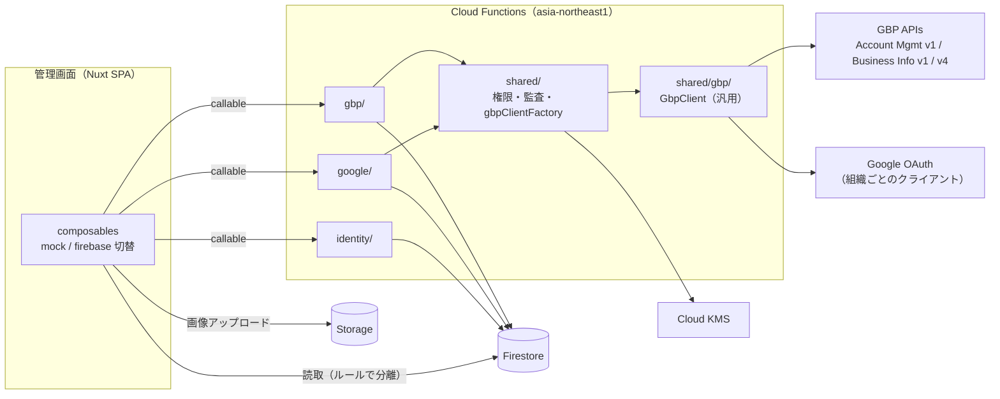

# Google Business Profile 連携 設計書

- 作成日: 2026-10-07
- 状態: レビュー待ち
- 関連: `docs/04-features.md` F-04 / F-05、`docs/02-database.md`、`docs/05-open-issues.md` I-05 / I-12

## 0. 目的と範囲

### 目的

管理画面から Google Business Profile（以下 GBP）を操作できるようにする。

- プロフィール一覧の取得・表示・更新
- 口コミへの返信（個別 / 一括）
- プロフィールへの投稿（個別 / 一括）

あわせて、管理画面をモックから Firebase 本接続へ切り替える（範囲は「基盤 + GBP」）。

### 決定事項（ヒアリング結果）

| 項目 | 決定 |
| --- | --- |
| 画面の接続 | 今回で本接続する。範囲は **基盤（認証・組織・メンバー・ルール）+ GBP** |
| 対象外画面 | ダッシュボード / アンケート / 回答 / 順位 / 利用量 / 運営。**モード切替**で、本物モードでは「準備中」表示 |
| GBP API の設定 | **組織ごとに自社 GCP** で API 申請・OAuth クライアント作成を行い、管理画面からクライアント ID / シークレットを登録する |
| 一括返信 | 同一文面 + 差し込み（`{投稿者名}` `{店舗名}`）。返信テンプレートを保存できる |
| 投稿種別 | 最新情報（STANDARD）/ イベント（EVENT）/ 特典（OFFER）。画像 1 枚・ボタン 1 つ。一覧・削除あり。予約投稿なし |
| プロフィール更新項目 | 説明・電話番号・ウェブサイト・営業時間・特別営業時間。店名・住所・カテゴリは表示のみ |
| GBP クライアント | fetch ベースの自前クラス。Firebase 非依存で他プロジェクトへ持ち出せる |
| 口コミ・投稿のデータ | Firestore に同期してキャッシュ（手動同期 + 口コミのみ日次同期） |

### 対象外

- アンケート / 回答 / 口コミ下書き生成 / 順位計測の本接続（後続サブプロジェクト）
- 運営管理画面の本接続、運営の Custom Claims
- Google アカウントでの管理画面ログイン
- 予約投稿、LLM による返信文生成
- 招待メールの送信（招待 URL をコピーして渡す運用のまま）

## 1. 全体構成



- **読み取り**はクライアントから Firestore を直接読む（ルールでテナント分離）
- **書き込み**はすべて callable Functions 経由
- Functions の region は全関数 `asia-northeast1`（`setGlobalOptions`）

## 2. GBP クライアントクラス（汎用）

### 2.1 配置と依存

```
functions/src/shared/gbp/
├─ GbpClient.ts             API 本体
├─ createTokenProvider.ts   refresh token → access token
├─ types.ts                 Account / Location / Review / LocalPost などの型
├─ errors.ts                GbpApiError / GbpAuthError
└─ index.ts                 公開 export
```

- このフォルダから **Firebase / プロジェクト固有コードを import しない**。フォルダをコピーすれば他プロジェクトで使える
- 外部依存は `google-auth-library` のみ。HTTP は Node 標準の `fetch`

### 2.2 インターフェース

```ts
type AccessTokenProvider = () => Promise<string>

interface GbpClientOptions {
  getAccessToken: AccessTokenProvider
  fetch?: typeof fetch                 // テストで差し替える
  retry?: { maxRetries: number; baseDelayMs: number } // 既定 3 回 / 500ms
}

createTokenProvider({ clientId, clientSecret, refreshToken }): AccessTokenProvider
```

| 区分 | メソッド | API / エンドポイント |
| --- | --- | --- |
| アカウント | `listAccounts()`（全ページ） | Account Management v1 `GET /v1/accounts` |
| プロフィール | `listLocations(accountName, readMask)`（全ページ） | Business Information v1 `GET /v1/{accounts/*}/locations` |
| | `getLocation(locationName, readMask)` | `GET /v1/{locations/*}` |
| | `updateLocation(locationName, patch, updateMask)` | `PATCH /v1/{locations/*}?updateMask=` |
| 口コミ | `listReviews(locationPath, { pageSize, pageToken, orderBy })` | v4 `GET /v4/{accounts/*/locations/*}/reviews` |
| | `listAllReviews(locationPath)` | 上記を全ページ取得 |
| | `updateReviewReply(reviewName, comment)` | v4 `PUT /v4/{accounts/*/locations/*/reviews/*}/reply` |
| | `deleteReviewReply(reviewName)` | v4 `DELETE .../reply` |
| 投稿 | `listLocalPosts(locationPath)`（全ページ） | v4 `GET /v4/{accounts/*/locations/*}/localPosts` |
| | `createLocalPost(locationPath, post)` | v4 `POST .../localPosts` |
| | `deleteLocalPost(postName)` | v4 `DELETE /v4/{accounts/*/locations/*/localPosts/*}` |

- v1 は `locations/{id}`、v4 は `accounts/{a}/locations/{id}` で指定する。変換 helper `toV4LocationPath(accountName, locationName)` をクラスと一緒に export する
- 1 メソッド = API 1 呼び出し（全ページ取得系を除く）。**一括処理の制御は持たない**（業務側の責務）

### 2.3 エラーと再試行

| 状況 | 挙動 |
| --- | --- |
| 429 / 500 / 502 / 503 / 504 | 指数バックオフで最大 `maxRetries` 回再試行 |
| トークン更新で `invalid_grant` / `invalid_client` | `GbpAuthError`（`reason` を保持）。再試行しない |
| その他の 4xx / 再試行上限超過 | `GbpApiError { status, reason, message }` |

## 3. 基盤（認証・組織・メンバー・ルール）

### 3.1 モード切替

| 環境変数 | runtimeConfig | 意味 |
| --- | --- | --- |
| `NUXT_PUBLIC_USE_MOCK` | `public.useMock` | `true` で全画面モック（現行動作）。既定 `true` |
| `NUXT_PUBLIC_USE_EMULATOR` | `public.useEmulator` | `true` でクライアントを Firebase Emulator に接続 |

- 対象 composable（`useAuth` / `useCurrentOrg` / `useMembers` / `useInvitation` / `useGoogleConnection` / `useStores` と、新設の GBP 系）は **戻り値の形を変えずに** 内部で mock / firebase を切り替える
- 本物モードの対象外画面: `AdminNavItem` に `isReady?: boolean` を追加しナビで「準備中」表示。ページはミドルウェア（`ready.global.ts`）で準備中ページを表示する
- `firebase.json` に Emulator（auth / firestore / functions / storage）の設定を追加

### 3.2 認証

- Firebase Auth のメール / パスワード。ログイン・新規登録・パスワード再設定（`sendPasswordResetEmail`）
- ログイン状態は `onAuthStateChanged` で `useState` に反映。`auth.global.ts` は初回の認証状態確定を待ってから判定する
- Firestore の Timestamp は composable 内のコンバーターで ISO 文字列へ変換し、`app/types/domain.ts` の型をそのまま使う

### 3.3 Functions（`identity/`）

モックの関数名にそろえる。

| 関数 | 内容 |
| --- | --- |
| `createOrganizationFunc` | `users` / `organizations` / owner の `members` を 1 トランザクションで作成。同じ uid・同じリクエスト ID の再実行で重複しない |
| `createInvitationFunc` | owner / admin。トークンはハッシュのみ保存し、平文 URL を返す |
| `updateInvitationAcceptFunc` | トークン検証 → メール一致確認 → `members` 作成 → 招待を `accepted` |
| `updateInvitationRevokeFunc` / `updateMemberRoleFunc` / `deleteMemberFunc` | owner / admin。owner の削除・降格は不可 |

`shared/` に置く共通処理:

- `requireAuth(request)` / `requireMember(orgId, uid, roles?)` / `requireStoreAccess(member, storeId)`
- `writeAuditLog(orgId, action, actorUid, payload)`
- `HttpsError` への変換 helper

`functions/src/index.ts` の既存初期化（serviceAccount による `initializeApp`）は維持し、`setGlobalOptions({ region: 'asia-northeast1' })` を追加する。

### 3.4 セキュリティルール

`docs/02-database.md` 5 章の方針のうち、今回の対象分を実装する。対象外コレクションは全拒否。

| 対象 | 読取 | 書込 |
| --- | --- | --- |
| `users/{uid}` | 本人 | 本人（`platformRole` 以外） |
| `organizations/{orgId}` | メンバー | Functions のみ |
| `members` | メンバー | Functions のみ |
| `invitations` | owner / admin | Functions のみ |
| `googleConnections` | owner / admin | Functions のみ |
| `stores` | メンバー（staff は担当店舗のみ） | Functions のみ |
| `gbpProfiles` `gbpReviews` `gbpPosts` | メンバー（staff は担当店舗のみ） | Functions のみ |
| `replyTemplates` | メンバー | Functions のみ |
| `oauthTokens` `oauthStates` `oauthClientSecrets` | 全拒否 | 全拒否 |

`storage.rules`: `orgs/{orgId}/gbpPosts/{file}` はメンバーのみ書込可（画像のみ・5MB 以下）。読取は誰でも可（Google が `sourceUrl` を取得するため）。

## 4. GBP 機能

### 4.1 組織ごとの OAuth クライアント

各組織が自社の GCP プロジェクトで GBP API の利用申請・OAuth クライアント（ウェブアプリケーション）作成を行い、管理画面から登録する。

| 関数 | 内容 |
| --- | --- |
| `updateGoogleOAuthClientFunc(orgId, clientId, clientSecret)` | owner のみ。シークレットを KMS で暗号化し `oauthClientSecrets/{orgId}` に保存。組織に `googleOAuthClient: { clientId, configuredAt, configuredBy }` を保存 |
| `deleteGoogleOAuthClientFunc(orgId)` | owner のみ。有効な連携が残っている場合は拒否 |

- **コールバック URL は全組織共通の 1 つ**（`googleOAuthCallbackFunc` の URL）。各組織は自社 OAuth クライアントの「承認済みのリダイレクト URI」に登録する。設定画面でコピーボタン付きで表示する
- 設定画面に手順ガイドを置く: ① GCP で GBP API を申請・有効化 ② OAuth 同意画面と OAuth クライアント作成（リダイレクト URI 登録）③ クライアント ID / シークレットを登録 ④ 「Google と連携」
- 手順ガイドには「OAuth 同意画面の公開ステータスが『テスト』のままだと refresh token が 7 日で失効する」注意を載せる

### 4.2 Google 連携・店舗取込（F-04 / F-05）

| 関数 | 内容 |
| --- | --- |
| `createGoogleAuthUrlFunc(orgId)` | owner / admin。組織の OAuth クライアント未登録なら `failed-precondition`。`oauthStates` に `{ orgId, uid, expiresAt(10 分) }` を保存し、認可 URL（`access_type=offline` `prompt=consent` `scope=business.manage`）を返す |
| `googleOAuthCallbackFunc`（onRequest） | state 検証・削除 → state の orgId のクライアントで code を交換 → refresh token を KMS 暗号化し `oauthTokens/{connectionId}` へ → `googleConnections` 作成（`listAccounts` の結果を保存）→ 設定画面へリダイレクト。失敗時は `?error=` 付きでリダイレクト |
| `deleteGoogleConnectionFunc` | Google 側 revoke → `oauthTokens` 削除 → 連携を `revoked`。取込済み店舗は残す |
| `getGbpLocationsFunc` | 連携ごとに `listLocations`（readMask: `name,title,storefrontAddress,latlng,metadata.placeId`）。取込済み・取込可否を付けて返す |
| `createStoresFromGbpFunc` | 店舗上限確認 → `stores` 作成（`gbpAccountName` `gbpLocationName` `placeId` `reviewUrl`）。`gbpLocationName` で重複防止 |

`shared/gbpClientFactory.ts`: `createGbpClientForConnection(orgId, connectionId)` が組織の OAuth クライアントと連携のトークンを KMS で復号して `GbpClient` を返す。`GbpAuthError` を捕捉したら連携を `status: 'error'` + `lastError` にし、`failed-precondition`（「Google 連携の再認証が必要です」）を返す。

### 4.3 データ（Firestore）

すべて `organizations/{orgId}` 配下。店舗をまたいで検索できるよう組織直下に置く。

**`stores/{storeId}`（追加フィールド）**

| フィールド | 型 | 説明 |
| --- | --- | --- |
| gbpAccountName | string | `accounts/...`。v4 API のパス組み立てに使う |

**`gbpProfiles/{storeId}`**

| フィールド | 型 | 説明 |
| --- | --- | --- |
| storeId | string | |
| title / address / categories | string / string / string[] | 表示のみ |
| description | string | `profile.description`（750 文字以内） |
| primaryPhone | string | `phoneNumbers.primaryPhone` |
| websiteUri | string | |
| regularHours | `{ openDay, openTime, closeDay, closeTime }[]` | 時刻は `HH:mm` |
| specialHours | `{ date, isClosed, openTime?, closeTime? }[]` | |
| syncedAt | Timestamp | |

**`gbpReviews/{reviewId}`**（ID は GBP の reviewId）

| フィールド | 型 | 説明 |
| --- | --- | --- |
| storeId / reviewName | string | `reviewName` は `accounts/*/locations/*/reviews/*` |
| reviewerName / reviewerPhotoUrl / isAnonymous | string / string / boolean | |
| starRating | 1〜5 | API の `ONE`〜`FIVE` を数値化 |
| comment | string \| null | 評価のみの口コミは null |
| reviewCreatedAt / reviewUpdatedAt | Timestamp | |
| reply | `{ comment, updatedAt } \| null` | |
| hasReply | boolean | 未返信絞り込み用 |
| syncedAt | Timestamp | |

**`gbpPosts/{postId}`**（ID は `{requestId}_{storeId}`）

| フィールド | 型 | 説明 |
| --- | --- | --- |
| storeId / postName | string / string \| null | `postName` は作成成功後に設定 |
| topicType | `'STANDARD' \| 'EVENT' \| 'OFFER'` | |
| summary | string | 1500 文字以内 |
| mediaUrl | string \| null | |
| callToAction | `{ actionType, url } \| null` | OFFER では使わない |
| event | `{ title, startAt, endAt } \| null` | EVENT / OFFER で必須 |
| offer | `{ couponCode?, redeemOnlineUrl?, termsConditions? } \| null` | |
| state | `'LIVE' \| 'PROCESSING' \| 'REJECTED' \| 'FAILED'` | `FAILED` は作成失敗（本ツール独自） |
| searchUrl | string \| null | Google 上の表示 URL |
| createdBy | string | uid |

**`replyTemplates/{templateId}`**: `name` / `body`（差し込み: `{投稿者名}` `{店舗名}`）

インデックス（複合）:

- `gbpReviews`: `storeId ASC, reviewCreatedAt DESC` / `hasReply ASC, reviewCreatedAt DESC` / `storeId ASC, hasReply ASC, reviewCreatedAt DESC`
- `gbpPosts`: `storeId ASC, createdAt DESC`

### 4.4 Functions（`gbp/`）

| 関数 | 権限 | 内容 |
| --- | --- | --- |
| `updateGbpProfilesSyncFunc(orgId, storeIds?)` | メンバー（staff は担当店舗） | `getLocation` → `gbpProfiles` を上書き |
| `updateGbpProfileFunc(orgId, storeId, patch)` | owner / admin | 変更項目から `updateMask` を組み立てて `updateLocation` → 応答で `gbpProfiles` を更新 |
| `updateGbpReviewsSyncFunc(orgId, storeIds?)` | メンバー（同上） | `listAllReviews` → `gbpReviews` を upsert（batch 書込） |
| `updateGbpReviewReplyFunc(orgId, items[])` | メンバー（同上） | **個別も一括も同じ関数**。`items: { reviewId, comment }[]`（1〜50 件） |
| `deleteGbpReviewReplyFunc(orgId, reviewId)` | メンバー（同上） | 返信削除 → キャッシュ更新 |
| `createGbpPostsFunc(orgId, requestId, storeIds[], post)` | メンバー（同上） | **個別も一括も同じ関数**。店舗 1〜20 件 |
| `deleteGbpPostFunc(orgId, postId)` | メンバー（同上） | GBP 側削除 → ドキュメント削除 |
| `updateGbpPostsSyncFunc(orgId, storeIds?)` | メンバー（同上） | `listLocalPosts` → `gbpPosts` を upsert（`state` 更新） |
| `createReplyTemplateFunc` / `updateReplyTemplateFunc` / `deleteReplyTemplateFunc` | owner / admin | テンプレート CRUD |
| `scheduledGbpReviewsSync` | — | 毎日 6:00 JST。`active` な連携の店舗の口コミを同期 |

### 4.5 一括処理

- `shared/runBatch.ts`: `runBatch(items, worker, { concurrency: 3 })` → `{ succeeded: Id[], failed: { id, message }[] }`
- 一括系の関数は `timeoutSeconds: 300`
- 部分失敗はエラーにせず結果で返す。画面は失敗分だけを選択状態に残し、再送できるようにする
- 差し込みは**クライアント側で展開**し、プレビューと送信内容を一致させる。サーバーは展開後の文面の長さ（4096 バイト以内）と空文字を検証する
- 冪等性
  - 返信は PUT のため再実行しても同じ結果
  - 投稿はクライアントが `requestId`（UUID）を発行し、`gbpPosts/{requestId}_{storeId}` が既に `postName` を持っていればスキップする
- 監査ログ: 返信（件数）・投稿・プロフィール更新・連携 / 解除・OAuth クライアント登録

### 4.6 画像

クライアントが Storage `orgs/{orgId}/gbpPosts/{uuid}.{ext}` にアップロードし、ダウンロード URL を `post.mediaUrl` として渡す。Functions は `media: [{ mediaFormat: 'PHOTO', sourceUrl }]` に変換する。

## 5. 画面

ナビに「Google ビジネス」グループを追加する。

| パス | 内容 | 権限 |
| --- | --- | --- |
| `/admin/[orgId]/profiles` | 店舗ごとのプロフィール一覧（店名・電話・サイト・営業時間の有無・最終同期）、「同期」ボタン | メンバー |
| `/admin/[orgId]/profiles/[storeId]` | プロフィール表示・編集（説明・電話・サイト・営業時間・特別営業時間） | 閲覧: メンバー / 編集: owner・admin |
| `/admin/[orgId]/reviews` | 口コミ一覧（店舗・未返信・評価で絞り込み）、個別返信、チェックして一括返信（プレビュー付き）、テンプレート管理モーダル、「同期」ボタン | メンバー |
| `/admin/[orgId]/posts` | 投稿一覧（店舗・種別・状態）、削除、「同期」ボタン | メンバー |
| `/admin/[orgId]/posts/new` | 投稿作成。店舗を選択（1 店舗 = 個別 / 複数 = 一括）、種別ごとの入力、画像 1 枚、ボタン、一括時は結果表示 | メンバー |
| `/admin/[orgId]/settings/google` | OAuth クライアント登録と手順ガイド、連携・再認証・解除、店舗取込 | owner・admin（OAuth クライアント登録は owner） |

- staff は担当店舗のみ表示・操作できる
- 連携が `error` の店舗の操作はボタンを無効化し、再認証を促す
- コンポーネント配置は CLAUDE.md の配置ルールに従う（例: `components/Gbp/Common/` `components/Gbp/Reviews/` `components/Gbp/Input/`）
- composables: `useGbpProfiles` / `useGbpReviews` / `useReplyTemplates` / `useGbpPosts`（mock / firebase 切替）

## 6. モックモード

- `app/utils/mock/functions/gbp.ts` に 4.4 の関数のモック版を追加
- `app/utils/mock/seed.ts` にプロフィール・口コミ（未返信を含む）・投稿・テンプレートのシードを追加
- GBP API の利用承認前でも画面開発とデモをモックで進められる

## 7. エラー処理

| 状況 | 画面の表示 |
| --- | --- |
| OAuth クライアント未登録 | 設定画面で手順ガイドを表示し、「Google と連携」を無効化 |
| 同意拒否 / `invalid_client` / リダイレクト URI 不一致 | 設定画面に戻し、原因別のメッセージ（クライアント ID・シークレット・リダイレクト URI の確認を促す） |
| `GbpAuthError`（トークン失効） | 連携を `error` にし、「再認証が必要です」 |
| 429（再試行後も失敗） | 「Google 側の利用上限に達しました。時間をおいて再実行してください」 |
| 一括処理の部分失敗 | 成功件数・失敗件数と失敗理由の一覧。失敗分だけ再送可能 |
| GBP 側で投稿が却下（`REJECTED`） | 一覧に状態バッジで表示 |

## 8. テスト

| 種類 | 対象 | 方法 |
| --- | --- | --- |
| 単体 | `GbpClient`（URL 組み立て・ページング・再試行・エラー分類） | 偽の `fetch` を注入。`node:test` |
| 単体 | `runBatch`、差し込み展開、`updateMask` 組み立て、営業時間の変換 | `node:test` |
| ルール | 3.4 の表（他組織の読取不可・staff の担当外不可・秘密コレクション全拒否） | Emulator + `@firebase/rules-unit-testing` |
| 結合 | 認証・組織作成・招待・店舗取込 | Emulator 上で手動確認 |
| 実 API | 連携・プロフィール更新・返信・投稿 | GBP API 承認後、テスト用ロケーションで手動確認 |

テスト観点（CLAUDE.md）:

- 正常系: 個別 / 一括の返信・投稿、プロフィール更新、同期
- 異常系: トークン失効、クォータ超過、権限なし（staff の担当外）、OAuth クライアント未登録
- 境界値: 一括 50 件 / 20 店舗、本文の文字数上限、評価のみの口コミ
- 既存機能への影響: `NUXT_PUBLIC_USE_MOCK=true` で現行の全画面がそのまま動くこと

## 9. 依存の追加

| 場所 | パッケージ | 用途 |
| --- | --- | --- |
| functions | `google-auth-library` | OAuth トークン交換・更新 |
| functions | `@google-cloud/kms` | refresh token / クライアントシークレットの暗号化 |
| functions（dev） | `@firebase/rules-unit-testing` | ルールテスト |

環境変数（functions）: `KMS_KEY_NAME`（`projects/*/locations/*/keyRings/*/cryptoKeys/*`）、`ADMIN_APP_URL`（コールバック後のリダイレクト先）、`OAUTH_CALLBACK_URL`。

## 10. 実装の順序

1. GBP クライアントクラス（`shared/gbp/`）と単体テスト
2. 基盤: モード切替・Emulator 設定・認証・`identity/` Functions・ルール
3. GBP: OAuth クライアント登録 → 連携・店舗取込 → プロフィール → 口コミ → 投稿（各段階で mock / firebase 両方）
4. `.claude/PROJECT.md` を MEO-Tool の実構成に書き直す、`docs/04-features.md` `docs/02-database.md` に本設計の追加分を反映

## 11. リスク・未決事項

| # | 内容 | 対応 |
| --- | --- | --- |
| 1 | GBP API は組織ごとに申請・承認が必要で、承認までクォータ 0（I-05） | 手順ガイドで案内。承認前はモックで検証 |
| 2 | `business.manage` は機微スコープ。未審査の OAuth アプリは警告画面が出る・テスト公開だと refresh token が 7 日で失効 | 手順ガイドに明記。自社アカウントのみで使う前提なら「本番」公開 + 未審査で運用可能 |
| 3 | 組織ごとに OAuth クライアントを持つため、連携トラブルの切り分けが組織の GCP 設定に依存する | エラーを原因別に表示（7 章） |
| 4 | KMS 鍵の作成・権限付与が事前に必要 | デプロイ手順を `PROJECT.md` に記載 |
