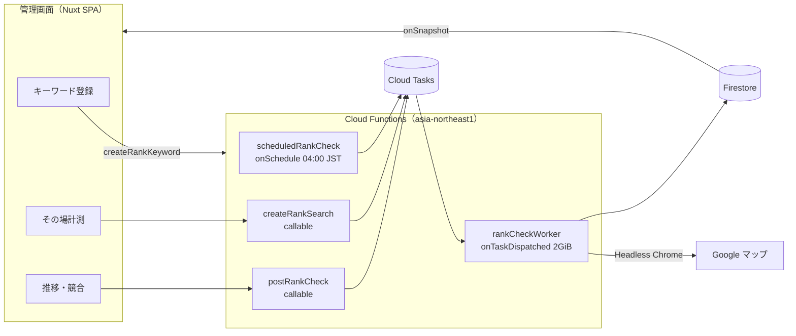

# 検索順位計測（Google マップ スクレイピング）設計書

- 作成日: 2026-10-08
- 状態: 実装済み（2026-10-08。Emulator での通し確認済み）
- 関連: `docs/04-features.md` F-15 / F-16 / F-17、`docs/02-database.md`、`docs/05-open-issues.md` I-07 / I-19 / I-26、`docs/06-cost-estimate.md`
- 参考: https://meotool.white-link.com/（Google マップ MEO 検索順位チェッカー）

## 0. 目的と範囲

### 目的

キーワード検索・検索順位・競合データの取得を、参考サイトと同等の仕様に変更し、モックから本接続する。

### 参考サイトの仕様（2026-10-08 に実画面で確認）

| 項目 | 仕様 |
| --- | --- |
| 入力 | 地域名（市区町村をリストから選択）／ビジネスアカウント名（完全一致）／キーワード（2〜100 文字、スペースで AND 検索、全角スペースは半角に変換） |
| 計測方式 | キュー投入（`add-queue`）→ 結果をポーリング。1 キーワード 10 秒弱 |
| 計測範囲 | 上位 20 位（Google マップの 1 ページ目）。21 位以下と不一致は「圏外」、失敗は「取得エラー」 |
| 結果表示 | 自店の順位 ＋ 1〜20 位の一覧（順位 / ビジネス名 / レビュー点数・件数） |
| 有料版 | 毎日の自動計測、順位推移のグラフ・表、複数キーワード |

### 決定事項（ヒアリング結果）

| 項目 | 決定 |
| --- | --- |
| 検索地点 | 緯度・経度の手入力をやめ、**市区町村の選択**にする。内部では市区町村の代表点（区域内の点）の座標を使う |
| 競合データ | **計測結果の上位 20 件**をそのまま使い、スナップショットに保存する。表示時の Place Details 取得は廃止 |
| その場計測 | キーワードを登録せずに、地域とキーワードでその場で計測する画面を追加する（I-19 を実施） |
| 取得元 | **自前で Google マップをスクレイピング**する（I-07 を決着） |
| 実装方式 | **Cloud Functions（2nd gen）上の Headless Chrome**（`puppeteer-core` ＋ `@sparticuz/chromium`） |
| 店舗の照合 | 参考サイトの店名完全一致ではなく、**placeId で照合**する。placeId が取れないときだけ正規化した店名で照合する |
| 維持する既存仕様 | 日次の自動計測、手動の「今すぐ計測」（1 時間に 1 回）、7 / 30 / 90 日の推移、プランごとの上限（`maxKeywords` / `monthlyRankChecks`）、権限 |

### リスク（承知のうえで採用）

- Google の利用規約は自動取得を禁じている。スクレイピングは規約違反にあたる。
- GCP の IP は bot 判定や CAPTCHA（`/sorry/`）を受けやすい。日次計測が止まる日がありうる。
- Google マップの画面構造が変わると取得が止まる。パーサーの修正が必要になる。
- 口コミ件数が取れない場合がある（4.1、I-27）。
- 対策：取得処理を `RankProvider` インターフェースに閉じ込める。後で SERP API（DataForSEO 等）や別方式に替えるときは、取得部だけの差し替えで済むようにする。

### 対象外

- グリッド計測（複数地点を格子状に計測）
- Yahoo! マップ
- 計測結果の CSV 出力
- スマホ表示での順位（デスクトップ版 Google マップのみ）
- プロキシの利用

## 1. 全体構成



- 投入側（scheduler / callable）と実行側（worker）を Cloud Tasks で分ける。Chromium を載せる重い関数はワーカーだけにする。
- 画面への結果の反映は Firestore の購読（`useFirestoreSync`）で行う。ポーリングはしない。

## 2. データモデル

### 2.1 検索地点（市区町村）

- データ元：国土数値情報「行政区域データ」（N03、2025-01-01 版、CC BY 4.0・商用可）。市区町村役場データ（P34）は使用許諾が非商用のため使わない。代表点は mapshaper の `-dissolve` と `-points inner` で求めた「区域内の点」で、役場の位置ではない。北方領土 6 件と所属未定地 7 件を除き、政令指定都市の本体 20 市を加えた 1,912 件。生成手順は `scripts/build-municipalities.mjs` の冒頭コメント
- 置き場所：`app/utils/geo/municipalities.json`

  ```ts
  type Municipality = { code: string; label: string; lat: number; lng: number }
  // 例: { code: "131130", label: "東京都渋谷区", lat: 35.6640, lng: 139.6982 }
  ```

- データは app 側にだけ置く。Functions に渡す値は既存の `SearchLocation { lat, lng, label }` のままで、代表点の座標と市区町村名を入れる。
- Functions 側では、`lat` / `lng` が日本の範囲内（緯度 20〜46、経度 122〜154）にあること、`label` が 1〜50 文字であることを検証する。
- 選択欄の初期値は、店舗の `lat` / `lng` から最も近い市区町村とする（app 側で近傍を計算する）。
- データ元の出典表示は、`docs/README.md` の 5 章と、`AreaSelect` の下（常に表示）に記載する。

### 2.2 キーワード

- 正規化：前後の空白を除き、全角スペースを半角に変換し、連続する空白は 1 つにまとめる。
- 長さ：正規化後に 2〜100 文字。今の上限 50 文字から変更する。
- スペース区切りは AND 検索になる旨を画面に表示する。
- 重複の判定は今と同じく、店舗 ＋ 正規化したキーワード ＋ lat/lng で行う。

### 2.3 `RankKeyword`（`organizations/{orgId}/rankKeywords/{keywordId}`）

既存の項目に次を追加する。前日比・前週比は、今と同じく画面側でスナップショットから計算する（`latest` の非正規化はしない）。

```ts
pendingCheckAt: Timestamp | null      // 手動計測を受け付けてから完了するまでのあいだ値が入る（「計測中」の表示）。10 分より古い値は計測中とみなさない
lastManualCheckAt: Timestamp | null   // 手動計測の 1 時間制限の判定に使う
createdBy: string
```

### 2.4 `RankSnapshot` と `RankResults`

本物モードの購読（`useFirestoreSync`）を軽く保つため、日々の順位（小）と 20 件の結果（大）を別のドキュメントに分ける。
どちらも staff の絞り込み（`storeId in`）ができるよう、組織直下に置き、ID は `{keywordId}_{YYYY-MM-DD}` にする。

`organizations/{orgId}/rankSnapshots/{keywordId}_{YYYY-MM-DD}`（直近 90 日を購読する）

```ts
type RankSnapshot = {
  orgId: string
  keywordId: string
  storeId: string
  checkedOn: string                 // YYYY-MM-DD（JST）
  checkedAt: Timestamp
  trigger: 'scheduled' | 'manual'
  status: 'ok' | 'error'
  errorCode: 'blocked' | 'timeout' | 'parse' | null
  rank: number | null               // null は圏外（21 位以下、または一致なし）。status が 'error' のときも null
  matchedBy: 'placeId' | 'name' | null
  resultCount: number
  provider: 'gmaps-scraper'
}
```

`organizations/{orgId}/rankResults/{keywordId}_{YYYY-MM-DD}`（購読しない。画面で日付を選んだときに 1 件読む）

```ts
type RankResults = { orgId: string; keywordId: string; storeId: string; checkedOn: string; results: RankResult[] }

type RankResult = {
  rank: number
  placeId: string | null
  name: string
  rating: number | null
  reviewCount: number | null
  category: string | null
}
```

- 廃止：`topPlaceIds`、`RankCompetitor` 型、`getRankCompetitorsFunc`、`getMockPlaceDetails`
- `status: 'ok'` の計測結果を、`status: 'error'` で上書きしない（同じ日にすでに ok があるときに手動計測が失敗した場合など）。
- `rankResults` は `status: 'ok'` のときだけ書く。

### 2.5 `RankSearch`（`organizations/{orgId}/rankSearches/{searchId}`）

```ts
type RankSearch = {
  keyword: string
  searchLocation: SearchLocation
  storeId: string | null            // 指定したときだけ自店の順位を出す
  status: 'queued' | 'running' | 'done' | 'error'
  errorCode?: 'blocked' | 'timeout' | 'parse'
  rank: number | null
  matchedBy: 'placeId' | 'name' | null
  results: RankResult[]
  createdBy: string                 // uid
  createdAt: Timestamp
  finishedAt: Timestamp | null
  expireAt: Timestamp               // createdAt + 30 日。Firestore の TTL ポリシーで自動削除する
}
```

- その場計測も月の計測回数（`usageMonthly.rankChecks`）に数え、`monthlyRankChecks` の上限の対象にする。

### 2.6 店舗の照合（`matchStore`）

1. `store.placeId` と一致する `RankResult.placeId` があれば、その順位を採用する（`matchedBy: 'placeId'`）。
2. 一致がなく、`placeId` が null の結果があれば、店名を比べる。比較は NFKC 正規化・空白の除去・小文字化をしたうえでの完全一致とする（`matchedBy: 'name'`）。
3. どちらでも見つからなければ圏外とする（`rank: null`、`matchedBy: null`）。

## 3. 計測の流れ

### 3.1 関数一覧（`functions/src/rankings/`）

| ハンドラー | export 名 | 種別 | 役割 |
| --- | --- | --- | --- |
| `createRankKeywordFunc` | `createRankKeyword` | callable | 登録。登録後に初回計測（manual）のタスクを投入する |
| `updateRankKeywordActiveFunc` | `updateRankKeywordActive` | callable | 有効 / 無効の切り替え |
| `deleteRankKeywordFunc` | `deleteRankKeyword` | callable | キーワードとスナップショットを削除する |
| `postRankCheckFunc` | `postRankCheck` | callable | 手動計測。同じキーワードは 1 時間に 1 回まで |
| `createRankSearchFunc` | `createRankSearch` | callable | その場計測の受け付け |
| — | `scheduledRankCheck` | onSchedule（毎日 04:00 JST） | 有効なキーワードのタスクをまとめて投入する |
| — | `rankCheckWorker` | onTaskDispatched | 取得 → 照合 → 書き込み |

- callable はすべて `shared/callable.ts` の `callable()` で包み、`(db, caller, data)` の形にする。
- 権限：キーワードの書き込み・今すぐ計測・その場計測は owner / admin のみ。

### 3.2 タスクの中身

```ts
type RankTask =
  | { kind: 'keyword'; orgId: string; keywordId: string; trigger: 'scheduled' | 'manual'; checkedOn: string }
  | { kind: 'search'; orgId: string; searchId: string }
```

### 3.3 ワーカーの設定

- メモリ 2GiB、`timeoutSeconds: 120`、`concurrency: 1`
- キューの設定：`maxConcurrentDispatches: 2`、`maxDispatchesPerSecond: 0.2`（5 秒に 1 件）
- 再試行：`retryConfig.maxAttempts: 3`、指数バックオフ（最小 30 秒）

### 3.4 冪等性

- 日次・手動の計測は、`rankSnapshots/{keywordId}_{checkedOn}` を上書きする。再実行されても同じ日のデータが置き換わるだけで、増えない。
- 日次のタスク名は `{orgId}-{keywordId}-{checkedOn}` にする。重複投入は Cloud Tasks が拒否する。手動計測は時刻を含めた名前にする。
- スナップショット・結果・`pendingCheckAt: null` は 1 つのトランザクションで書く。
- 使用回数の加算は、受け付けた時点（callable と scheduler）で行う。ワーカーが再試行しても二重に数えない。
- その場計測のワーカーは、開始時に `status` を見る。すでに `done` / `error` なら何もしない。`queued` なら `running` に更新してから計測する。
- 再試行回数を使い切った（最後の試行が失敗した）ときに、`status: 'error'` を保存する。途中の失敗では保存せず、例外を投げて再試行に回す。

### 3.5 日次計測の負荷

- 同時実行 2、1 件約 10 秒で、1 時間に約 700 キーワードが上限の目安。
- 投入の間隔は、キューの `maxDispatchesPerSecond` で空ける（`scheduleDelaySeconds` は使わない）。
- 月の上限（`monthlyRankChecks`）を超える組織のキーワードは投入しない。
- ブロックが続く日の打ち切り
  - ワーカーは、日次の集計ドキュメント `rankRuns/{YYYY-MM-DD}` に `done` / `blocked` の件数を加算する。
  - `trigger: 'scheduled'` のタスクは、開始時にこの集計を読む。`blocked` が 10 件以上で、その割合が 30% を超えていたら、取得をせずに `status: 'error'`・`errorCode: 'blocked'` を保存して終了する。
  - 打ち切ったときはエラーログを 1 回出す。
  - 手動計測とその場計測は打ち切りの対象にしない。
- 最後の試行かどうかは、タスクの再試行回数（`X-CloudTasks-TaskRetryCount`）で判定する。

## 4. スクレイパー

### 4.1 実画面で確認した事実（2026-10-08）

- 結果の一覧は `div[role="feed"]`。最初は 7 件程度で、スクロールで追加される。
- 口コミ件数（`reviewCount`）は、headless の Chrome ではカードに出ないことがある（2026-10-08 確認）。その場合は `null`（画面は「—」）。bot 検知を回避する手段（UA の偽装など）は使わない。確実に取りたい場合は `RankProvider` を SERP API に差し替える（`docs/05-open-issues.md` I-27）
- 実画面での確認結果（2026-10-08）：「渋谷 カフェ」は 20 件を 5.6〜7.6 秒で取得し、placeId はすべて `ChIJ` だった。結果なしの判定文言は「が見つかりません」
- 各店舗は `a[href*="/maps/place/"]`。`aria-label` に店名が入っている。
- placeId は、リンクの URL に含まれる `!19s(ChIJ…)` から取得できる。22 件中 22 件で取得できた。
- 評価と口コミ数は `span[role="img"]` の aria-label に「4.1 つ星 クチコミ 195 件」の形で入っている。口コミ数にはカンマが付く（例「2,123 件」）。
- カテゴリは店舗カードのテキストの 3 行目、`·` で区切った最初の要素（例「カフェ・喫茶」）。

### 4.2 構成

```
functions/src/rankings/
  providers/rankProvider.ts      interface RankProvider { search(keyword: string, at: { lat: number; lng: number }): Promise<RankResult[]> }
  providers/gmapsScraper.ts      Puppeteer の操作（起動・移動・スクロール・生データの抜き出し）
  providers/parseGmapsItems.ts   生データ → RankResult[]（純粋関数）
  matchStore.ts                  照合（純粋関数）
  rankCheckWorker.ts             取得 → 照合 → 書き込み
  __tests__/probe.ts             実計測の確認用スクリプト（npm run rank:probe）
```

- `gmapsScraper` が返すのは、画面から抜き出した生データの配列 `{ name, href, starLabel, text, isSponsored }[]` だけとする。解析は `parseGmapsItems` が担当する。

### 4.3 取得の手順

1. `https://www.google.com/maps/search/{encodeURIComponent(keyword)}/@{lat},{lng},14z?hl=ja&gl=jp` を開く。
2. `div[role="feed"]` が出るまで待つ（最大 15 秒）。
3. フィードをスクロールする。次のいずれかで止める。
   - 広告を除いた件数が 20 を超えた
   - 「リストの最後に到達しました」が出た
   - 5 回スクロールしても件数が増えない
4. 「スポンサー」の付いたカードは除外し、残りの上位 20 件に順位 1〜20 を振る。
5. 結果が 1 件だけで、一覧ではなく店舗ページ（URL が `/maps/place/`）に直接移動した場合は、そのページを 1 位として読む（**実画面では未確認**。「渋谷区役所」は直接移動せず一覧で返った）。
6. 次の場合はエラーにする。
   - URL に `/sorry/` を含む、または同意画面（`consent.google.com`）が出た → `blocked`
   - 時間切れ → `timeout`
   - 0 件で、なおかつ「結果なし」の表示もない → `parse`
   - 「結果なし」の表示が出た場合はエラーにせず、0 件で圏外とする。
7. Chromium はインスタンス内で使い回し、ページはタスクごとに開いて閉じる。

## 5. 画面

### 5.1 変更する画面

| 画面 | 変更 |
| --- | --- |
| `Ranking/Rankings/KeywordFormModal.vue` | 緯度・経度の入力欄を `RankingInputAreaSelect` に置き換える。キーワードは 2〜100 文字で、AND 検索の注意書きを付ける |
| `pages/admin/[orgId]/rankings/index.vue` | `pendingCheckAt` があるあいだは「計測中」と表示し、今すぐ計測ボタンを無効にする。最新のスナップショットが `status: 'error'` なら「取得エラー」と表示する。地点の欄は `label` を表示する |
| `pages/admin/[orgId]/rankings/[keywordId].vue` | 競合一覧は、選んだ日のスナップショットの `results` を `RankingCommonRankResultsTable` で表示する。推移グラフでは、エラーの日を圏外と分けて灰色のマーカーで示す |
| `Ranking/Common/RankTrendChart.vue` | エラーの日の表示を追加する |

### 5.2 新規画面 `pages/admin/[orgId]/rankings/search.vue`（その場計測）

- 入力：地域（`RankingInputAreaSelect`）、キーワード、店舗（任意。選ぶと地域の初期値をその店舗の最寄りの市区町村にする）
- 計測中：「計測中…（10 秒ほどかかります）」と表示する
- 完了：「"{キーワード}"の順位計測　検索順位 N 位／圏外」と、1〜20 位の表を表示する
- エラー：「取得エラー。しばらく時間を置いてから再度お試しください」と表示する
- 直近 30 日の計測履歴の一覧を表示する。行を選ぶと結果を再表示する
- 店舗を指定した結果には「このキーワードを登録」ボタンを出す。押すと、キーワード登録のモーダルを入力済みの状態で開く
- `rankings/index.vue` に「その場で計測」への導線を置く。staff には表示しない

### 5.3 部品の配置

| ファイル | 呼び出し名 | 理由 |
| --- | --- | --- |
| `components/Ranking/Input/AreaSelect.vue` | `<RankingInputAreaSelect />` | 入力部品（判定順 1）。2 画面で使う |
| `components/Ranking/Common/RankResultsTable.vue` | `<RankingCommonRankResultsTable />` | 2 画面で使う |
| `components/Ranking/Search/*` | `<RankingSearch... />` | その場計測の画面専用 |

- composables
  - `useRankSearch.ts`（新規）：その場計測の作成・購読・履歴
  - `useRankHistory.ts`：競合を取得する処理（`getRankCompetitorsFunc` の呼び出しと `watch`）を削除する
  - `useRankKeywords.ts`：`useMockDb` を直接使うのをやめ、`useAppDb` を使う
- 注意書き：「検索順位は検索した人の位置や端末によって変わるため、目安としてご覧ください」を、計測結果の表示箇所に出す。

## 6. 権限・ルール・設定

- `firestore.rules`
  - `rankKeywords`・`rankSnapshots`・`rankResults`：メンバーは読み取りのみ。staff は担当店舗のもののみ読める。
  - `rankSearches`：owner / admin のみ読める（その場計測は owner / admin だけの機能のため）。
  - `usageMonthly`：メンバーは読める。
  - 書き込みはすべて Functions のみ。
  - `rankRuns`：全拒否（Functions のみ）。
- `firestore.indexes.json`
  - `rankSnapshots (storeId ASC, checkedOn ASC)`（staff の購読）
  - collection group `rankKeywords.isActive`（日次計測の走査）
- TTL ポリシー：`rankSearches.expireAt`（`gcloud firestore fields ttls update` で設定。手順は PROJECT.md に記載する）
- `useAdminNav.ts` の `FIREBASE_READY_PATHS` に `/rankings` を追加する。
- `functions/package.json` に `puppeteer-core` と `@sparticuz/chromium` を追加する。Chromium のバージョンは、互換表に合う組み合わせを context7 で確認してから決める。

## 7. モックモード

- `app/utils/mock/rank.ts`：疑似の計測結果を `results`（20 件。名前・評価・口コミ数・カテゴリ付き）の形で作る。自店はハッシュで決まる順位に置く。
- `app/utils/mock/functions/rankings.ts`
  - `createRankSearchFunc` を追加する。`queued` → `running` → 約 2 秒後に `done` と状態を変える。
  - `getRankCompetitorsFunc` を削除する。
- `app/utils/mock/seed.ts`：初期データのスナップショットを新しい形にそろえる。エラーの日を数日分入れる。

## 8. テスト

| 対象 | 種類 | 観点 |
| --- | --- | --- |
| `parseGmapsItems` | 単体（fixture は実画面から抜き出した JSON） | 正常系：20 件。異常系：評価なし、広告の混入、placeId なし、カンマ付きの口コミ数。境界値：ちょうど 20 件、21 件以上は切り捨て、0 件 |
| `matchStore` | 単体 | placeId で一致、店名で一致（全角と半角・空白の差）、不一致、placeId が別の店舗で店名だけ同じ（一致させない） |
| キーワードの正規化と検証 | 単体 | 1 文字、2 文字、100 文字、101 文字、全角スペース、連続スペース |
| `rankCheckWorker` | Emulator 結合（`RankProvider` をフェイクにする） | 同じタスクの 2 回実行、ok を error で上書きしない、使用回数を二重に数えない、`pendingCheckAt` の解除 |
| `createRankSearch` / `postRankCheck` | Emulator 結合 | staff は拒否、上限超過、1 時間制限 |
| `firestore.rules` | ルールテスト | staff の担当外の読み取り拒否、クライアントからの書き込み拒否 |
| 既存機能への影響 | 手動確認 | モックモードの一覧・推移・競合表示、口コミ同期のスケジュールに影響しないこと |

- Puppeteer の部分は CI では実行しない。`npm run rank:probe -- "渋谷 カフェ" 35.664 139.698` で手元から実計測して確認する。

## 9. ドキュメントの更新

- `docs/05-open-issues.md`
  - I-07：「自前スクレイピングで決着。規約違反とブロックのリスクを承知のうえで採用し、`RankProvider` で差し替えられるようにする」
  - I-19：その場計測を実施するため解決済みにする
  - I-26：Places API を使わなくなるため解決済みにする
- `docs/02-database.md`：2 章の型、`rankSearches`、`rankRuns`、TTL を反映する
- `docs/04-features.md`：F-15 / F-16 / F-17 を更新し、その場計測を追加する
- `docs/03-pages.md`：`rankings/search` を追加し、KeywordFormModal のパスを修正する
- `docs/06-cost-estimate.md`：Place Details の費用を削除し、Functions 2GiB の実行費用と Cloud Tasks の費用を追記する
- `.claude/PROJECT.md`：順位計測の構成（ワーカー、キュー、TTL の設定手順、`rank:probe`）を追記する
